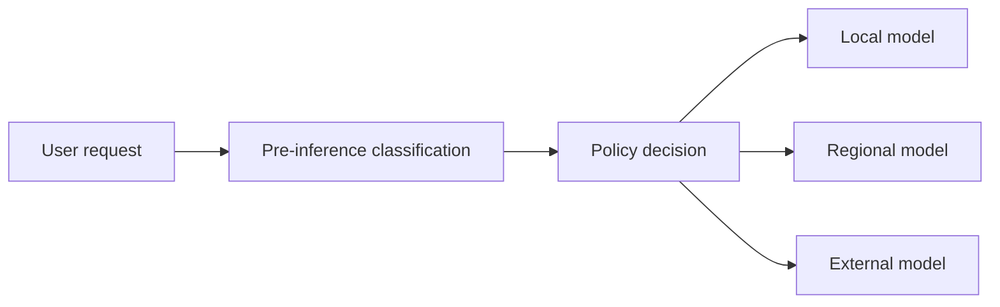
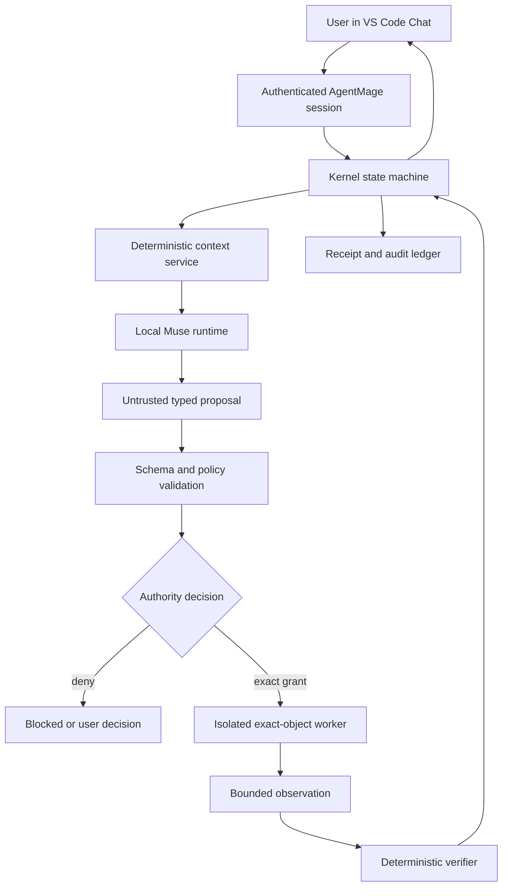
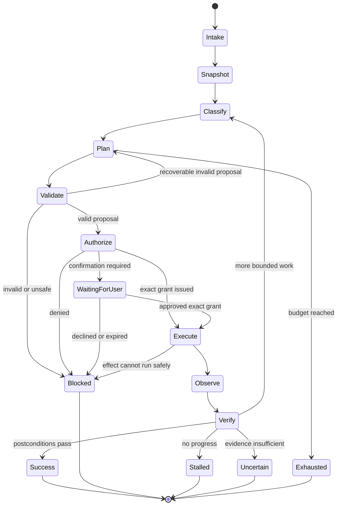
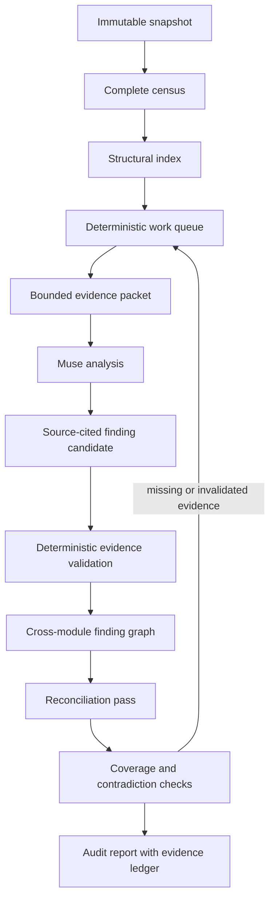

# Clean-Room Muse Glimmer Agent Harness Assessment

**Document type:** Non-normative research assessment

**Research cutoff:** 2026-08-12

**Repository assessed:** AgentMage, branch `agent/expand-delivery-windows-ga`

**Decision status:** Research only. This document does not amend the PRD,
requirements inventory, security baseline, implementation plan, task order,
model admission status, or release claims.

## Executive Assessment

The proposed direction makes technical sense, with one important correction:
Claude Code is not a deterministic coding engine whose behavior can be copied
by placing a deterministic wrapper around another model. Its public architecture
is an agent loop driven by a probabilistic language model, surrounded by
deterministic and probabilistic controls. Anthropic's public descriptions include
permission rules, sandbox boundaries, typed lifecycle messages, context
compaction, hooks, budgets, classifiers, and outcome-oriented evaluation. The
model still chooses text and tool requests probabilistically.

AgentMage should therefore not attempt to make Meta Muse Glimmer itself fully
deterministic. The useful and defensible target is:

> A probabilistic local planner inside a deterministic effect machine.

Under that design, Muse Glimmer may propose a typed plan or tool call, but it
cannot authorize, execute, verify, or declare success for a consequential
effect. AgentMage's Rust kernel remains the authority. It validates the proposal,
checks policy and exact-object grants, mediates a bounded worker, observes the
result, runs deterministic postcondition checks, records evidence, and decides
whether the state machine may continue. The user remains the authority for
judgment calls and expanded access.

This direction aligns well with AgentMage's strongest implemented work:

- `ToolCall` is already a request rather than authority.
- `EffectAuthorization` is already kernel-issued, non-cloneable, and consumed
  at the effect boundary.
- The authority transaction, exact-object path model, durable store, Linux
  workers, and receipts already establish a stronger control plane than a
  prompt-only agent scaffold.
- `CODEBASE-AUDIT.md` already specifies a sound large-repository strategy based
  on a complete census, deterministic structural indexing, bounded evidence
  packets, cross-module reconciliation, checkpoints, invalidation, and source
  citations.

The principal gaps are integration gaps, not a need for another architectural
pivot. AgentMage does not yet have an integrated `LocalModelRuntime`, model tool
protocol adapter, sustained agent loop, context service, outcome verifier, or
end-user coding workflow. Muse Glimmer is currently a late candidate admission
item, not an enabled model. Those facts must remain explicit.

The supplied ComplianceGate paper contributes one useful idea: classify a
request before selecting a model or permitting external handling. It does not
provide an adequate security authority or a suitable implementation dependency.
Its public artifacts are non-commercially licensed, internally inconsistent,
probabilistic, weakly calibrated, and contain serious prototype security defects.
AgentMage should retain deterministic rules as the primary classifier, treat any
learned classifier as advisory or escalation-only, and fail toward a safer
boundary or a human decision.

Meta Muse Glimmer is a credible model candidate for the current Linux workstation.
Its official 17 GB text GGUF should fit within the installed RTX 4090's 24 GB of
VRAM under a bounded context profile, subject to measurement. It has promising
published coding and tool-use results, an official llama.cpp integration, and
first-party Meta provenance. It is also very new, its llama.cpp support is very
new, its recommended generation profile is sampled rather than deterministic,
its security results show meaningful prompt-injection risk, and its separate
usage policy requires product and legal review. It must remain `CANDIDATE` until
the existing admission process reaches a truthful disposition.

The recommended next move is an early, isolated Muse admission and runtime spike
inside the existing Sprint 13-15 dependency area, while preserving Sprint 165 as
the final integrated disposition gate. The first slice should be text-only,
strict-local, read-only, single-slot, non-speculative, and limited to synthetic
repositories. Vision, DFlash speculative decoding, large context windows,
workspace writes, network access, and connected Git authority should each be
admitted separately.

## Direct Answers

### Can AgentMage approximate Claude Code with Muse Glimmer?

Yes, at the level that matters to a user: repository understanding, iterative
tool use, edits, test execution, recovery from failures, evidence-backed
completion, and safe interaction with a workspace. It cannot honestly promise
behavioral identity with Claude Code. Model quality, proprietary prompting,
training, product integrations, and evaluation infrastructure differ. Public
benchmarks do not establish parity.

The right objective is a measured capability envelope, not imitation. AgentMage
should define and test its own requirements for repository navigation, edit
quality, tool-call validity, test repair, context retention, recovery, latency,
resource use, safety, and auditability.

### Is Claude Code deterministic under the hood?

No. Anthropic's public agent-loop documentation describes repeated model calls
that may emit text or tool requests. Its evaluation guidance explicitly recommends
multiple trials because agent outputs vary. Auto mode adds probabilistic input
and output classifiers around actions; Anthropic publishes nonzero false-negative
and false-positive rates for those classifiers. Deterministic components exist,
but the overall agent is not deterministic.

Relevant primary sources are Anthropic's
[agent-loop documentation](https://code.claude.com/docs/en/agent-sdk/agent-loop),
[evaluation guidance](https://www.anthropic.com/engineering/demystifying-evals-for-ai-agents),
and [auto-mode engineering report](https://www.anthropic.com/engineering/claude-code-auto-mode).

### Can Muse Glimmer itself be made deterministic?

Only in a narrow, qualified sense. A pinned runtime, artifact, prompt, chat
template, sampler sequence, seed, slot count, hardware, driver, and build may
produce repeatable output in a controlled profile. That is not a portable or
permanent guarantee. PyTorch states that complete reproducibility is not
guaranteed across releases, platforms, or even CPU and GPU executions. llama.cpp
also has a still-unmerged draft pull request for broader CUDA deterministic
numerics, which confirms that fixed sampling alone is not a complete numerical
determinism guarantee.

AgentMage may offer a **repeatability profile**, but must not describe it as
absolute model determinism. The higher-value guarantees are deterministic
authorization, bounded effects, outcome verification, and evidence replay.

### Should ComplianceGate become AgentMage's router?

No. The paper's broad pattern can inform the design, but neither the released
model nor its public server should become a product dependency. Its license is
CC-BY-NC-4.0, its reported experiment and public artifacts disagree, and its
prototype disables TLS verification in outbound clients and loads a pickle-
compatible PyTorch artifact with unsafe deserialization enabled.

AgentMage should build deterministic policy classification first. If a learned
classifier is later justified, it should be independently trained or selected
under AgentMage's provenance and license gates, calibrated on representative
data, able to abstain, and prohibited from granting authority.

## Scope And Research Method

This assessment used four evidence classes:

1. **Primary first-party documentation and artifacts.** Anthropic product and
   engineering documentation; Meta model cards, usage policy, GGUF repository,
   and methodology; llama.cpp documentation and pull requests; PyTorch
   reproducibility documentation.
2. **Lawfully public source code.** The public ComplianceGate repository and
   AgentMage itself. Public code was inspected at pinned revisions where
   available.
3. **Research papers and preprints.** The supplied ComplianceGate paper and
   three recent agent-scaffold studies. These are evidence, not product truth;
   their methods and limitations are evaluated below.
4. **Secondary incident reporting.** Used only to establish the basic timeline
   and vendor statement around the Claude Code npm packaging incident.

The supplied PDF was read in full after checking its metadata and extracting its
text. Its SHA-256 digest is
`715fc1ad1087e39149870de1c83cf8d9aa6917576c8c70416f565064b50c43b1`.
The public version is
[arXiv:2606.31163v2](https://arxiv.org/abs/2606.31163).

### Clean-room boundary

This assessment deliberately did **not** retrieve, clone, execute, reproduce,
or analyze leaked proprietary Claude Code source maps or mirrors. That boundary
is necessary for four reasons:

- The accidentally packaged material was not intentionally open-sourced.
- Using proprietary implementation details would contaminate an independent
  Apache-2.0 project and create avoidable copyright and provenance risk.
- Fake repositories claiming to host leaked material have been reported as a
  malware-delivery vector.
- AgentMage does not need proprietary code to adopt well-established public
  agent patterns such as a tool loop, sandboxing, permission mediation,
  compaction, and outcome-based evaluation.

The source-level paper *Dive into Claude Code* was treated as a secondary,
contamination-sensitive description. No unique implementation detail from that
paper is proposed here unless the same concept is supported by Anthropic's
official public documentation or by genuinely open-source agent research.

This is a clean-room architecture assessment, not a reconstruction of Claude
Code.

## The Claude Code Packaging Incident

### What happened

On 2026-03-31, Claude Code npm package version 2.1.88 reportedly included a large
JavaScript source map. The map exposed internal TypeScript source content that
normally would not have shipped in the production package. Anthropic removed the
affected package version. A public issue in Anthropic's repository records the
[2.1.88 source-map exposure](https://github.com/anthropics/claude-code/issues/41666),
and Anthropic told Axios that internal source was included but customer data and
credentials were not. See the
[Axios incident report](https://www.axios.com/2026/03/31/anthropic-leaked-source-code-ai).

This was a build and packaging disclosure, not evidence that the Claude model's
weights, training data, customer prompts, authentication secrets, or production
service were compromised. It is also not evidence that Claude Code's behavior is
deterministic.

### What AgentMage should learn from it

The most relevant lesson is supply-chain hygiene:

- Build release artifacts from a clean checkout.
- Enumerate the exact package contents before signing.
- Reject source maps, debug symbols, private paths, test fixtures, local history,
  and undeclared files unless intentionally included.
- Compare the release manifest against an allowlist.
- Scan packaged text and archives for secrets, internal identifiers, absolute
  paths, and source material.
- Reinstall the produced package into a clean environment and inspect the
  installed payload, not merely the source tree.
- Sign the exact manifest and payload after inspection.
- Keep symbol and diagnostics artifacts in a separately controlled channel.
- Treat package-yank and emergency-disable procedures as tested release
  capabilities.

AgentMage already has substantial package-manifest, clean-build, signing,
artifact-scan, rollback, and emergency-disable planning. The incident reinforces
those controls; it does not justify studying proprietary source.

## Public Claude Code Architecture

### The core loop is simple

Anthropic publicly describes an agent loop with these steps:

1. Assemble the system prompt, tools, user messages, and current history.
2. Ask the model for the next response.
3. If the response contains tool requests, execute eligible tools.
4. Append typed tool results to history.
5. Continue until the model returns without a tool request or a limit terminates
   the run.

The product's difficulty lies around that loop: permissions, lifecycle state,
context management, sandboxing, tool design, recovery, observability, and
evaluation. This is consistent with Anthropic's
[public agent-loop contract](https://code.claude.com/docs/en/agent-sdk/agent-loop)
and its general guidance to begin with simple, composable agent patterns in
[Building Effective Agents](https://www.anthropic.com/engineering/building-effective-agents).

### Permission precedence is outside the model

Anthropic documents a permission sequence involving hooks, deny rules, ask
rules, permission modes, allow rules, and an application callback. A model tool
request is not itself permission. Denied tools may be removed from the model's
available context, which reduces both accidental and adversarial invocation.
See the official
[permissions documentation](https://code.claude.com/docs/en/agent-sdk/permissions).

This validates AgentMage's more explicit kernel pattern: model proposals should
cross a policy and grant boundary before an effect-bearing worker can launch.

### Sandboxing must cover files and networks

Anthropic's sandboxing description separates filesystem restrictions from
network restrictions. On Linux it uses Bubblewrap; on macOS it uses Seatbelt.
Network egress can be routed through a policy proxy, and credentials can remain
outside the sandbox. A scoped Git proxy can expose only the operation authorized
for the current repository. See
[Claude Code sandboxing](https://www.anthropic.com/engineering/claude-code-sandboxing).

The associated containment report makes a particularly important distinction:
model defenses are probabilistic, while environmental containment can establish
a hard boundary. It also warns against parsing or executing project-local
configuration before workspace trust is established. See
[How We Contain Claude](https://www.anthropic.com/engineering/how-we-contain-claude).

AgentMage should preserve this order:

1. Establish workspace identity and trust.
2. Enumerate files as data.
3. Do not execute hooks, shell initialization, build scripts, extensions, MCP
   configuration, or repository-local agent instructions merely because they
   exist.
4. Expose only risk-appropriate tools.
5. Bind each effect to exact authority and an isolated worker.

### Context is an engineered resource

Anthropic documents automatic compaction and recommends subagents for large
reads because each file and instruction consumes context. Subagents isolate a
large working set and return a smaller result to the parent. Some path-specific
context can be lost during compaction and must be reloaded when relevant. See
the official [context-window documentation](https://code.claude.com/docs/en/context-window).

This supports AgentMage's proposed census, structural index, evidence-card,
packet, checkpoint, and invalidation architecture. A large repository should not
be pasted into one prompt, and a model summary should never replace the source
record from which it was derived.

### Auto mode is a probabilistic safety layer

Anthropic's 2026 auto-mode report describes an input probe and an output
transcript classifier. The output classifier sees user messages and executable
tool calls while excluding prose and tool output; a fast stage can precede a
reasoning stage. Published evaluations still show nonzero misses and false
alarms. Repeated denials eventually cause human escalation or termination. See
[Claude Code auto mode](https://www.anthropic.com/engineering/claude-code-auto-mode).

The design lesson is not to replace policy with a classifier. A classifier can
deny, narrow, or escalate. It must not create permission. AgentMage's exact grant
and worker boundaries must remain authoritative even if a classifier is added.

### Brain, hands, and event history can be separated

Anthropic's managed-agent architecture separates the model/harness, isolated
tools and sandboxes, and a session/event service. See
[Building a C Compiler with a Team of Parallel Claudes](https://www.anthropic.com/engineering/managed-agents).
AgentMage can adopt the generic separation without adopting proprietary code:

- **Brain:** local model adapter and bounded planner loop.
- **Authority:** kernel policy, grants, state transitions, and budgets.
- **Hands:** exact-object workers in an OS sandbox.
- **Memory:** content-addressed observations, decisions, results, and receipts.
- **Shell:** Visual Studio Code Chat as display and user-interaction authority.

### Evaluation must inspect the environment

Anthropic recommends multiple trials, deterministic graders where possible,
isolated evaluation environments, transcript review, and grading the resulting
environment rather than trusting the agent's claim. See
[Demystifying Evals for AI Agents](https://www.anthropic.com/engineering/demystifying-evals-for-ai-agents).

That principle should be absolute in AgentMage: the model may propose that a task
is complete, but only a verifier may establish a successful terminal state.

## Recent Agent-Scaffold Research

### Dive into Claude Code

[*Dive into Claude Code: A Source-Level Study of an Agentic Coding System*](https://arxiv.org/abs/2604.14228)
describes the leaked TypeScript package and characterizes a small central loop
surrounded by permissions, context management, sessions, extensions, and
subagents. Because its evidence base is inadvertently disclosed proprietary
source, this report uses it only to identify questions and then verifies the
relevant high-level claims against Anthropic's public documentation.

No AgentMage design or code should cite that paper as implementation provenance,
and no source-specific names, data structures, prompts, thresholds, or algorithms
should be copied from it.

### Inside the Scaffold

[*Inside the Scaffold: A Structural Analysis of Open-Source Agentic Coding Systems*](https://arxiv.org/abs/2604.03515)
examines 13 genuinely open-source coding agents at pinned commits. Its useful
findings are:

- Most systems compose a small number of loop primitives.
- Tool sets converge around read, search, edit, and execute.
- Context compaction becomes necessary for sustained autonomy.
- Benchmark results confound the model, scaffold, prompts, tools, and runtime.
- Fair harness comparisons must hold the model and evaluation environment fixed.

The paper is a static snapshot with limited author and implementation diversity,
so it is a taxonomy rather than proof of which architecture is best. It supports
building AgentMage from explicit contracts and measuring the complete system.

### Stop Hand-Holding Your Coding Agent

[*Stop Hand-Holding Your Coding Agent: The Case for Loop Engineering*](https://arxiv.org/abs/2607.00038)
proposes that an autonomous loop needs a trigger, goal, verification rule,
stopping states, and durable memory. Its verification ladder moves from
deterministic checks through rules and field truth to model judges and human
review. It also emphasizes named terminal states, no-progress ceilings, and
separating the maker from the checker when a model judge is unavoidable.

This is a position paper rather than a controlled product comparison, but its
loop vocabulary fits AgentMage well. The strongest applicable rule is:

> Error, exhaustion, uncertainty, and a model's unsupported assertion are never
> success.

## ComplianceGate Paper Assessment

### Claimed design

The July 2026 ComplianceGate paper proposes a 134 million parameter BERT-like
classifier that assigns a prompt to one of six combinations of complexity and
PII state. The class then selects among local, regional, and cloud model tiers.
The paper reports 99.2 percent routing accuracy, near-perfect PII recall, about
7 ms routing overhead, a 39 percent latency reduction, and cost savings across
600 controlled queries. A confidence below 80 percent is intended to route to
the most restrictive `complex_pii` class.

The architectural sequence is directionally useful:

Classification before disclosure is preferable to sending sensitive content to
a model and asking that model whether disclosure was appropriate.

### Experimental inconsistencies

The paper and public artifacts do not describe one reproducible experiment:

| Topic | Paper | Hugging Face card | GitHub implementation |
|---|---|---|---|
| Training examples | 50,000 | 60,000 | 50,000 claimed |
| Training steps | 12,000 | 5,000 | 8,000 claimed |
| Output classes | Six | Six | Four in server code |
| Confidence threshold | 80 percent | Calibration limitation noted | 70 percent default |
| Savings | 33-52 percent in narrative | Not independently reproduced | No benchmark harness |

The cost arithmetic also conflicts internally. The equal-distribution example
produces 52 percent savings, while a figure reports 33 percent. Two other stated
traffic distributions imply approximately 69.5 and 74 percent savings under the
paper's own formula, outside the abstract's 33-52 percent range.

The latency comparison changes multiple variables at once, including model,
input length, and deployment tier. Six hundred controlled queries without
published confidence intervals, statistical tests, representative corpus detail,
or same-prompt counterfactual comparisons cannot support broad claims that the
approach eliminates privacy risk.

The generation experiment itself used temperature 0.3, top-k 10, and top-p 0.9.
It was not deterministic.

### Public model limitations

The public
[Hugging Face model card](https://huggingface.co/deycoding/deycoding-compliance-classifier-router)
identifies synthetic training data, English and Hinglish focus, 128-token
truncation, possible misses on novel PII patterns, unverified calibration and
out-of-distribution behavior, and no extraction or masking capability. It
correctly describes the model as defense in depth. Those caveats conflict with
the paper's stronger language that risk is eliminated by design.

A 128-token classifier cannot safely determine the sensitivity of an arbitrary
repository packet, long email thread, document, tool transcript, or codebase
audit request. Sensitive material can occur after truncation, across chunks, in
an attachment, or in a tool result that was not present in the initial prompt.

### Public code findings

The public repository was inspected at commit
[`a5267e842bf2fcdf090da3d882bf63ce6569b9b8`](https://github.com/deycoding/deycoding-compliance-classifier-router/tree/a5267e842bf2fcdf090da3d882bf63ce6569b9b8).
It is an illustrative prototype, not a safe policy gateway:

| Finding | Impact |
|---|---|
| Server code exposes four labels while the paper specifies six. | Published behavior and deployed behavior cannot be reconciled. |
| `torch.load` is invoked with `weights_only=False`. | A malicious or substituted pickle-compatible artifact can execute code during loading. |
| Outbound `httpx` clients use `verify=False`. | TLS certificate verification is disabled, permitting interception and endpoint substitution. |
| No test suite was present at the pinned commit. | Reported routing, failure, and security behavior is not continuously verified. |
| No request authentication is implemented. | Any reachable caller can submit content and consume routing services. |
| Responses and metrics can expose raw prompt information. | Sensitive content can cross a new observability boundary. |
| Cloud configuration allows broad outbound egress. | A logical route label is not an independently enforced destination or jurisdiction boundary. |
| Confidence fallback differs from the paper. | The claimed safety posture is not the shipped default. |

The relevant public files are
[`server/server.py`](https://github.com/deycoding/deycoding-compliance-classifier-router/blob/a5267e842bf2fcdf090da3d882bf63ce6569b9b8/server/server.py),
[`router/router.py`](https://github.com/deycoding/deycoding-compliance-classifier-router/blob/a5267e842bf2fcdf090da3d882bf63ce6569b9b8/router/router.py),
and
[`agent/agent.py`](https://github.com/deycoding/deycoding-compliance-classifier-router/blob/a5267e842bf2fcdf090da3d882bf63ce6569b9b8/agent/agent.py).

### License disposition

The released classifier and repository use CC-BY-NC-4.0. AgentMage is intended
for public distribution under Apache-2.0 and should not take a non-commercial
model or code dependency without an explicit, compatible licensing decision.
The idea of pre-inference classification is not proprietary; the artifact and
implementation are unsuitable.

### What to adopt and what to reject

Adopt:

- Classify before an external disclosure or authority-bearing action.
- Separate sensitivity from task complexity.
- Preserve a fail-closed or human-escalation path for uncertainty.
- Measure latency, quality, security, and resource cost together.
- Record the routing decision and evidence.

Reject:

- A classifier as the source of permission.
- Confidence as a proxy for safety.
- Prompt-level classification as the only PII control.
- A model-selected geographic route without network enforcement.
- Silent fallback to a more capable or more exposed tier.
- Pickle-compatible model loading in a privileged process.
- Disabled TLS verification.
- Unauthenticated model or router endpoints.
- Claims of risk elimination based on a small synthetic benchmark.

## Meta Muse Glimmer Candidate Assessment

### Exact identity

The candidate assessed here is Meta's first-party
[Muse Glimmer 30B model](https://huggingface.co/meta-models/Muse-Glimmer-30B)
and its
[official GGUF repository](https://huggingface.co/meta-models/Muse-Glimmer-30B-GGUF).
The evidence snapshot used these repository revisions:

| Artifact | Revision |
|---|---|
| Transformer repository | `a4e59da52a7bc87ae7251dd5545c0dd437c44b68` |
| GGUF repository | `a0532f7263ee67f1e0a5f5c5fdcd50dd62fc9aa4` |
| llama.cpp Muse integration | Merged pull request 26841, merge commit `62bf73d` |

Those revisions are research evidence, not yet AgentMage admission records. The
model was not downloaded or executed during this assessment.

### Architecture and intended use

The official card describes a dense causal language model of approximately
29.6 billion parameters plus an approximately 1.8 billion parameter perception
encoder. It uses 52 transformer layers, a hidden size of 6,656, 32 query heads,
two key/value heads, local and global attention, a 2,048-token sliding window,
and a stated maximum context length of 131,072 tokens.

The model is positioned for reasoning, coding, tool use, research, and visual
interaction. It supports selectable reasoning strengths. The official card
recommends higher reasoning strengths for coding, but the GGUF prompt template
does not completely disable reasoning. AgentMage must regard hidden or emitted
reasoning as untrusted model output and must not require chain-of-thought capture
for auditability.

Audit evidence should retain:

- the model request hash;
- the exact model, tokenizer, template, runtime, and decoding profile IDs;
- the parsed proposal;
- policy and authorization decisions;
- tool observations and verifier results;
- a concise user-visible rationale where appropriate.

It should not retain or expose private chain-of-thought.

### License and usage-policy review

The first-party repositories identify Apache-2.0 for the model artifacts. Meta
also publishes a separate
[Muse usage policy](https://huggingface.co/meta-models/Muse-Glimmer-30B/blob/main/USAGE_POLICY.md)
that restricts prohibited uses and says the model is not intended for individuals
under 18. It includes restrictions concerning malicious code, unlawful or
harmful activities, sensitive data, and some regulated professional activity.

This creates a mandatory admission question. An Apache-2.0 artifact label does
not by itself resolve whether AgentMage's broad public product scope and every
planned adapter are compatible with the separate policy. Before enabling the
model, AgentMage should obtain and record a product/legal disposition for:

- public redistribution versus user-initiated download;
- adult-use limitations and user-facing disclosure;
- coding-security and dual-use workflows;
- finance, health, legal, employment, and other planned productivity surfaces;
- processing of personal, confidential, or regulated data;
- acceptable-use enforcement and update procedures;
- policy version drift after installation.

This report does not offer a legal conclusion. Until that review is complete,
the correct model status is `CANDIDATE`, not `SUPPORTED`.

### Official decoding profile is stochastic

The first-party generation configuration specifies:

| Setting | Official value |
|---|---|
| Sampling | Enabled |
| Temperature | 1.0 |
| Top-p | 0.95 |
| Top-k | 64 |
| Maximum length | 131,072 |
| EOS token IDs | 200001 and 200008 |

That profile is explicitly non-deterministic. AgentMage should evaluate two
separate profiles:

1. **Reference quality profile.** The official sampled profile, with the
   recommended coding reasoning level, used to measure the capability Meta
   intended.
2. **Diagnostic repeatability profile.** A pinned greedy/top-k-only profile with
   `top_k=1`, fixed seed, one server slot, one request at a time, no speculative
   decoding, and a fixed prompt/template/runtime stack.

The quality profile answers whether Muse is good enough. The repeatability
profile answers whether failures can be reproduced. Neither profile should
silently replace the other, and results from one must not be attributed to the
other.

AgentMage's current configuration invariant requiring temperature 0 and top-k 1
for a field named deterministic decoding is directionally useful but
overstates what those two settings prove. The field should eventually be backed
by a complete, versioned repeatability manifest and renamed or documented so it
does not claim cross-platform numerical determinism.

### Tool protocol details

Muse Glimmer's official prompt template uses an ATEM-like tool protocol. The
template, tokenizer, end-of-message handling, and reasoning controls are part of
the model artifact, not incidental prompt text. The `<|eom|>` marker is a message
boundary rather than the only generation stop condition, and the official
generation configuration names two EOS token IDs.

The AgentMage adapter must therefore:

- pin and hash the exact tokenizer and chat template;
- use the first-party tool format without free-form prompt reconstruction;
- distinguish message boundaries from terminal generation;
- parse streaming partial tokens without executing partial tool calls;
- enforce one closed, versioned AgentMage proposal schema after translation;
- reject duplicate IDs, unknown tools, unknown fields, invalid UTF-8, oversized
  arguments, non-finite numbers, trailing data, and ambiguous multiple calls;
- bind every proposal to the session, turn, model run, and current context packet;
- treat parser failure as `INVALID_PROPOSAL`, never as a shell command;
- prevent model-emitted text from entering a command line or path parser without
  typed validation.

The model-specific protocol belongs in the adapter. Kernel contracts must remain
model-neutral.

### Official benchmark evidence

Meta reports the following selected results in its model card:

| Benchmark | Reported score |
|---|---:|
| SWE-Bench Pro | 51.2 |
| SWE-Bench Verified | 76.0 |
| Terminal-Bench | 51.7 |
| SciCode | 43.6 |
| MCP Atlas | 75.5 |

These results make Muse Glimmer a serious candidate. They do not establish
Claude Code parity or AgentMage product quality. Meta's
[published methodology](https://research.meta.ai/static/muse-glimmer-methodology)
uses benchmark-specific harnesses, sampling, repeated runs, and in some cases
model judges. The SWE evaluation used a relatively small set of file and shell
tools and averaged multiple runs. A score belongs to the complete tested tuple:
model, artifact, quantization, prompt, tools, scaffold, runtime, decoding,
hardware, benchmark version, and grader.

AgentMage must reproduce or independently adapt relevant tests under its own
authority and sandbox boundaries before making product claims.

### Published security evidence

Meta reports meaningful residual agent risk rather than a security guarantee.
The model card includes an AgentDojo/Siren attack-success figure of 28.4 percent
with benign utility of 94.2 percent, plus a CI Memories violation score of 26.4
with 64.8 coverage. The exact interpretation depends on Meta's methodology, but
the product conclusion is unambiguous: Muse Glimmer must not receive ambient
workspace, credential, network, or tool authority.

Meta also recommends system-level guardrails and human confirmation for
irreversible actions. AgentMage's kernel controls are therefore prerequisites,
not optional hardening.

### GGUF artifacts

The official GGUF repository contained these principal artifacts at the assessed
revision:

| Artifact | Exact bytes | LFS SHA-256 object ID | Admission scope |
|---|---:|---|---|
| Text k-quant GGUF | 16,756,681,056 | `7e9b74...c488d8` | Initial text-only candidate |
| Dynamic GGUF | 19,653,957,984 | `513109...f106c` | Separate candidate |
| Vision projection | 1,400,328,928 | `f48b45...c00c6` | Separate vision gate |
| DFlash draft | 1,631,205,312 | `27d9a8...a677bc` | Separate speculative gate |

The abbreviated object IDs in this narrative are for readability. Admission
records must store complete digests retrieved from first-party metadata and
verify the bytes before loading.

The first supported experiment should use only the approximately 17 GB text
artifact. Dynamic quantization, vision projection, and the DFlash draft model
change the runtime and risk tuple and require independent evidence.

### llama.cpp runtime maturity

Official Muse Glimmer support was merged into llama.cpp through
[pull request 26841](https://github.com/ggml-org/llama.cpp/pull/26841) on
2026-08-10. Meta's card requires at least build b10353. At this assessment's
cutoff, the integration was approximately two days old. The pull request also
describes tool calling as an initial/basic implementation.

This is acceptable for an isolated spike, not enough for a supported runtime
claim. AgentMage should pin an exact llama.cpp commit, vendor or verify the
source and release artifacts under its supply-chain policy, and run conformance
tests for:

- model load and unload;
- tokenizer parity;
- prompt-template parity;
- text generation and cancellation;
- streaming frame boundaries;
- tool-call parsing;
- EOS and end-of-message behavior;
- context exhaustion;
- malformed requests;
- concurrent-request rejection in the repeatability profile;
- server crash and restart;
- memory exhaustion and cancellation cleanup;
- loopback or inherited-pipe isolation;
- zero unintended egress;
- artifact substitution;
- runtime version mismatch.

### DFlash is a separate product tuple

Meta reports substantial speed gains from DFlash speculative decoding and says
it maintains output quality. A quality claim does not prove token-for-token
identity, deterministic acceptance behavior, or equal tool-call validity under
AgentMage's workload. Speculative decoding changes the execution path and adds a
second artifact.

The first repeatability profile must disable DFlash. A later DFlash candidate
needs its own artifact digest, runtime configuration, resource measurements,
quality trials, tool-call conformance, repeatability trials, and failure
disposition. It must be possible to disable DFlash without changing the base
model profile.

### Current Linux workstation fit

The development workstation observed during this assessment has:

| Resource | Observed capacity |
|---|---|
| GPU | NVIDIA GeForce RTX 4090 |
| VRAM | 24,564 MiB total |
| CPU | Intel Core i9-13900KF, 32 logical CPUs |
| System memory | Approximately 64 GiB |
| Free filesystem capacity | Approximately 1.4 TB |

The official text GGUF should fit in VRAM, but the weight size alone does not
establish a usable configuration. KV cache, compute buffers, runtime overhead,
display use, context length, batching, and vision or speculative artifacts all
consume additional memory. The machine also showed heavily used swap during the
snapshot, which should be resolved or controlled before performance testing.

The admission matrix should measure at least 8k, 16k, and 32k context profiles
before considering larger windows. A stated 131k model context does not imply
that a 131k local session will fit or perform well on a 24 GB GPU. Every profile
must report:

- load time and peak host/VRAM use;
- prompt-processing and generation throughput;
- first-token and end-to-end latency;
- cancellation latency;
- sustained thermal behavior;
- context-length failure mode;
- recovery after out-of-memory;
- tool-call validity rate;
- output quality and repeatability results.

### Muse candidate disposition

At the research cutoff, the justified disposition is:

| Dimension | Research finding |
|---|---|
| First-party identity | Promising and verifiable |
| Origin and lineage | First-party Meta lineage identified; full admission still required |
| Artifact license | Apache-2.0 stated |
| Separate use restrictions | Material; legal/product review required |
| Linux runtime | Newly available in llama.cpp; not yet AgentMage-tested |
| Current hardware fit | Likely for bounded text profile; not measured |
| Coding quality | Strong vendor-reported evidence; not AgentMage-verified |
| Tool use | Supported by template and vendor benchmarks; parser conformance unknown |
| Security | Residual injection risk is material; strict containment required |
| Repeatability | Possible as a narrow diagnostic profile; not guaranteed |
| AgentMage status | `CANDIDATE`; no enablement or support claim |

## AgentMage Current-State Fit

### Existing strengths to preserve

AgentMage already contains the beginnings of the correct control architecture.
These are not merely documentation aspirations:

1. [`kernel/contracts/src/tool.rs`](../../kernel/contracts/src/tool.rs) defines a
   typed `ToolCall`, `OperationOutcome`, and state-change vocabulary. The call is
   a request, not authority.
2. [`kernel/engine/src/authority_transaction.rs`](../../kernel/engine/src/authority_transaction.rs)
   defines a kernel-created `EffectAuthorization` that cannot be freely
   constructed, cloned, or reused. The exact grant is consumed before an effect.
3. The engine has durable authority and operational stores, exact held targets,
   restart recovery, and receipt-oriented evidence.
4. Linux worker work already establishes Bubblewrap-oriented exact-object
   projection and strict-local boundaries.
5. [`CODEBASE-AUDIT.md`](../../CODEBASE-AUDIT.md) defines a source-grounded large-
   repository audit architecture rather than assuming one giant prompt.
6. [`MODEL-PROVENANCE-POLICY.md`](../../MODEL-PROVENANCE-POLICY.md) already treats
   models as attributable, versioned candidates that must pass source, license,
   artifact, runtime, quality, resource, and platform gates.
7. [`TASKS.md`](../../TASKS.md) already requires explicit model selection before
   a later measured router and forbids routing based on model self-confidence.

These controls are more important to dependable behavior than recreating any
vendor's prompt or hidden scaffold.

### Current gaps

The repository remains a pre-alpha scaffold. The following capabilities do not
yet exist as one integrated user-visible path:

| Gap | Consequence |
|---|---|
| No implemented `LocalModelRuntime` product adapter | AgentMage cannot load or query Muse through its kernel contract. |
| No Muse admission record | Identity, policy, resource fit, runtime, and quality are not product evidence. |
| No model-protocol translator | Muse tool output cannot safely become an AgentMage `ToolCall`. |
| No sustained loop state machine | Turn limits, retries, stopping, and recovery are not integrated. |
| No context-packet service | Whole-repository work remains planned, not executable. |
| No verifier registry | A model assertion can be displayed, but no generic system establishes completion. |
| No integrated coding workers | Read, edit, command, and Git workflows do not form a complete coding loop. |
| No harness evaluation suite | Vendor benchmark scores cannot be translated into AgentMage capability claims. |
| Misleading decoding shorthand | Temperature 0 plus top-k 1 is necessary for a greedy profile but not proof of full determinism. |
| Muse admission occurs very late in the roadmap | Runtime feasibility could be discovered after substantial dependent work. |

These gaps argue for an early vertical slice, not for bypassing the existing
dependency order or security gates.

### The planning adjustment should be additive

Sprint 13 is already the first incomplete `LocalModelRuntime` work, Sprint 15
already covers deterministic-first/manual model selection, Sprint 49 reserves a
measured router, and Sprint 165 contains final Muse candidate disposition. A
future approved planning decision should:

- add an **early Muse technical and policy pre-admission spike** around Sprints
  13-15;
- keep the model disabled outside synthetic evidence runs;
- preserve Sprint 165 as the final integrated admission and trusted-operations
  reconciliation gate;
- prohibit the spike from creating a release, support, or enablement claim;
- leave Gemma or another lawful fallback lane independently eligible;
- add evidence rather than deleting any existing requirement.

No normative planning document is changed by this assessment.

## Target Architecture

### Governing principle

The target is not deterministic natural-language generation. The target is a
deterministic and inspectable control path around an untrusted probabilistic
planner:

Trust flows from the kernel to a narrowly scoped worker. It never flows from the
model to the kernel.

### Component responsibilities

| Component | May do | Must never do |
|---|---|---|
| VS Code shell | Display state, collect intent and confirmation | Hold workspace, model, credential, or effect authority |
| Context service | Census, hash, index, redact, packetize, cite | Execute repository content or silently broaden scope |
| Muse adapter | Format prompts, run inference, parse candidate protocol | Read the workspace, access tools, hold credentials, grant permission |
| Agent loop | Advance typed states within limits | Manufacture authority or self-certify success |
| Policy engine | Apply deterministic rules and select required confirmation | Delegate permission to model confidence |
| Authority store | Issue and consume exact grants | Issue ambient or reusable authority |
| Worker | Execute one exact authorized operation | Inherit home, credentials, broad network, or unrelated workspace access |
| Verifier | Inspect declared postconditions and evidence | Accept model prose as proof |
| Audit service | Record hashes, decisions, outcomes, and receipts | Store unnecessary secrets or private reasoning |

### Brain, authority, hands, and evidence

AgentMage should formalize four independent interfaces:

1. **Planner interface.** Converts a bounded context packet into text, a question,
   a plan, or a typed proposal. Muse Glimmer implements this through
   `LocalModelRuntime`.
2. **Authority interface.** Converts validated user intent and policy state into
   a kernel-only, exact, expiring, single-use grant or a denial.
3. **Effect interface.** Consumes a grant and runs one operation inside the
   appropriate platform worker.
4. **Evidence interface.** Converts observations into typed postcondition results,
   receipts, and state transitions.

This split makes the model replaceable. It also permits deterministic test
adapters to exercise the entire loop without a real model.

## Deterministic Agent State Machine

### Required states

The loop should be an explicit, persisted state machine rather than a recursive
chat callback:

Recommended terminal states are:

- `SUCCESS`: all required postconditions passed against observed state.
- `NO_OP`: the requested state already existed and was independently verified.
- `BLOCKED`: policy, authority, dependency, or environment prevented safe work.
- `DECLINED`: the user declined or revoked the required action.
- `STALLED`: repeated turns produced no measurable progress.
- `EXHAUSTED`: turn, token, time, effect, or cost budget was consumed.
- `UNCERTAIN`: available evidence cannot establish success or a safe next step.
- `CANCELLED`: the user or system cancelled and all in-flight effects were
  classified.
- `FAILED`: an operation failed and recovery did not restore the required state.

Only `SUCCESS` and verified `NO_OP` are successful outcomes. A friendly final
model message cannot change the terminal state.

### Persisted loop record

Every transition should persist a minimal typed record containing:

- session, task, turn, and correlation IDs;
- prior and next state;
- objective and scope hash;
- repository snapshot ID;
- context packet and tool-catalog IDs;
- model-run manifest and proposal hash;
- classifier and policy decision IDs;
- grant and effect receipt IDs where applicable;
- verifier ID, inputs, and result;
- remaining budgets;
- interruption and cancellation state;
- redaction and retention classification;
- transition reason code.

The record must be sufficient to explain why an effect happened without storing
private chain-of-thought.

### Budgets and no-progress detection

The kernel, not the model, should enforce:

- maximum turns;
- maximum model tokens and context rebuilds;
- maximum tool proposals and executed effects;
- command duration and output size;
- maximum repeated parser failures;
- maximum repeated policy denials;
- maximum identical or semantically equivalent proposals;
- maximum unchanged verification results;
- wall-clock and resource ceilings;
- cancellation deadlines.

Progress must be measured from observable state: a new cited fact, a changed
validated plan, a permitted file change, a new test result, or a resolved
postcondition. More prose is not progress.

### Recovery behavior

After interruption, AgentMage should reload the persisted state, revalidate the
workspace snapshot and policy version, classify any in-flight effect, and then
choose exactly one of:

- resume an unchanged pending step;
- repeat a proven idempotent observation;
- verify an effect that may have completed;
- invalidate dependent context and replan;
- require a new user decision;
- terminate as uncertain or blocked.

It must never replay a consumed grant or assume that a timed-out effect did not
occur.

## Model Proposal Contract

### Proposal classes

Muse output should translate into one of a closed set of proposal classes:

- `Respond`: provide user-facing text with no effect.
- `AskUser`: request a bounded missing fact or judgment.
- `RequestEvidence`: ask the context service for specific repository evidence.
- `ProposeToolCall`: request one typed tool operation.
- `ProposePlan`: provide an ordered set of proposed steps for kernel validation.
- `ProposeCompletion`: identify claimed postconditions for independent checking.
- `YieldBlocked`: identify a typed blocker without claiming success.

The model never emits a grant, terminal state, raw worker instruction, or direct
shell authority.

### Closed-envelope requirements

A translated proposal should carry at least:

| Field | Purpose |
|---|---|
| `schema_version` | Reject unsupported protocol variants. |
| `proposal_id` | Detect duplicates and replays. |
| `session_id` and `turn_id` | Bind output to one live loop. |
| `model_run_id` | Link to the exact inference manifest. |
| `context_packet_id` | Prevent use against a different snapshot. |
| `proposal_kind` | Select one closed validation path. |
| `operation` | Name one registered tool operation, never arbitrary code. |
| `arguments` | Typed, bounded, operation-specific data. |
| `claimed_preconditions` | Trigger kernel checks; never establish truth. |
| `claimed_postconditions` | Select verifiers; never establish success. |
| `expected_state_change` | Support preview and reconciliation. |

Unknown fields should fail closed in authority-bearing proposal types. Optional
forward-compatible display metadata can live in a separately ignored envelope.

### Streaming rule

Streaming improves responsiveness but must not create incremental authority.
AgentMage may display provisional text, but it must buffer a complete tool
proposal, observe the terminal protocol marker, verify size and syntax, and then
perform schema validation. A partially streamed command or path is inert.

### Tool catalog minimization

The model should see only tools that are eligible in the current state and risk
profile. Examples:

- A strict read-only audit turn sees census, search, bounded read, and citation
  tools, not edit, command, Git write, email, or network tools.
- A synthetic edit turn may see exact patch and verification tools inside a
  disposable fixture, not the real workspace.
- A connected Git turn sees only the repository, host, account, ref, and
  operation approved for that session.

Removing unavailable tools from the prompt reduces invalid calls and limits the
attack vocabulary, but kernel denial remains mandatory.

## Determinism Taxonomy

The word deterministic must be qualified. AgentMage should distinguish at least
five properties:

| Property | Meaning | Realistic guarantee |
|---|---|---|
| Token repeatability | Identical generated tokens for a pinned run tuple | Narrow diagnostic profile only |
| Decision reproducibility | Same validated input reaches the same policy result | Strong for versioned deterministic rules |
| Effect determinism | Same authorized operation causes the same transition | Strong for some local operations; qualified for tests, clocks, networks, and external systems |
| Outcome determinism | Success is based on the same observable postconditions | Strong when verifiers are deterministic and inputs are pinned |
| Audit reproducibility | A reviewer can replay how inputs led to decisions and effects | Strong with hashes, versions, receipts, and immutable evidence |

The product's safety must not depend on token repeatability. Even if Muse emits a
different valid plan on every run, each plan must encounter the same authority
rules, scope restrictions, worker boundary, and completion checks.

### Repeatability manifest

Every measured model run should bind:

- model repository, revision, artifact name, size, and full digest;
- tokenizer and chat-template digests;
- llama.cpp source commit, build flags, compiler, and binary digest;
- CUDA, driver, GPU architecture, CPU architecture, and relevant library
  versions;
- quantization and tensor placement;
- context size, batch sizes, slot count, thread count, and cache settings;
- sampler list and order, temperature, top-k, top-p, seed, penalties, and grammar;
- reasoning-strength and token-budget settings;
- speculative decoding state and draft artifact;
- exact system prompt, tool catalog, input packet, and generation limits;
- output token IDs, parsed proposal, latency, and resource observations.

Without that manifest, a statement that the same prompt produced a different
answer is not diagnostically useful.

### Current runtime limitation

llama.cpp documents seeds, sampler controls, grammars, and JSON-schema constrained
generation in its
[CLI documentation](https://github.com/ggml-org/llama.cpp/blob/master/tools/cli/README.md).
Its sampling discussion notes that a top-k-only sampler with `k=1` is the direct
greedy configuration after sampler changes. See
[llama.cpp discussion 3005](https://github.com/ggml-org/llama.cpp/discussions/3005).

Broader CUDA numerical determinism remains a draft, unmerged proposal in
[llama.cpp pull request 16016](https://github.com/ggml-org/llama.cpp/pull/16016).
Even that proposal explicitly limits cross-device and cross-driver guarantees.
PyTorch's official
[reproducibility note](https://docs.pytorch.org/docs/stable/notes/randomness)
similarly warns that complete reproducibility is not guaranteed across releases
and platforms.

AgentMage should say **repeatable under the recorded profile**, never simply
**deterministic model**.

## Classification And Routing

### Separate three questions

ComplianceGate combines concerns that AgentMage should keep distinct:

1. **Data sensitivity:** What information is present, and where may it flow?
2. **Action risk:** What effect is proposed, how reversible is it, and what
   authority would it require?
3. **Task capability:** Which enabled model profile has measured competence for
   this class of work?

Sensitivity and action risk govern policy. Capability may guide a model
recommendation only after policy establishes eligible destinations.

### Deterministic rules first

The primary classifier should be a versioned Rust rules engine over typed facts:

- current autonomy mode;
- operation taxonomy;
- exact source and destination;
- network boundary and account identity;
- repository and dirty-state identity;
- path class and held-object state;
- credential and secret indicators;
- data labels and user markings;
- reversibility and recovery evidence;
- external disclosure;
- executable-content and untrusted-configuration indicators;
- requested privilege;
- applicable connector and provider policy;
- current model and tool admission state.

Rules should produce a typed result such as `ALLOW_READ`, `REQUIRE_PREVIEW`,
`REQUIRE_CONFIRMATION`, `REQUIRE_REAUTHENTICATION`, `DENY`, `REDACT`,
`ISOLATE`, or `ABSTAIN_FOR_HUMAN`.

### Learned classifier role

A later learned classifier may identify likely PII, prompt injection, task class,
or anomalous tool sequences. It may:

- add a sensitivity label;
- remove a tool;
- request redaction;
- force stricter isolation;
- require user review;
- deny or stop a sequence;
- emit evidence for later evaluation.

It may not:

- issue or widen a grant;
- override a deterministic denial;
- choose an external destination that rules excluded;
- reveal content to classify whether revealing it is safe;
- treat high confidence as permission;
- silently switch models or providers;
- mark a task complete.

Low confidence, out-of-distribution input, model unavailability, truncation, or
classifier disagreement must lead to a narrower boundary or human decision.

### Continuous classification

Classification cannot occur only once at intake. AgentMage must reclassify:

- every newly read file or extracted attachment;
- command output and test logs;
- generated patches;
- Git diffs and commit messages;
- connector responses;
- model-created context summaries;
- proposed external messages;
- backup and diagnostic payloads.

Data can become sensitive or adversarial after a tool call. The policy decision
must bind the exact content hash and destination at the point of effect.

### No multi-tier routing in the first Muse slice

The current workstation can plausibly host one 30B model, but simultaneously
resident large models would create memory pressure and complicate attribution.
The first Muse slice should have explicit user selection and one loaded profile.
Routing should initially select workflow depth, tool catalog, context budget, and
required verification, not a hidden model tier.

A later router belongs behind Sprint 49's measured-evidence gate. It should use
task class, risk, and empirical success rates, never the active model's statement
that it is confident.

## Whole-Codebase Context Architecture

### The model must not receive a repository handle

Muse Glimmer should never be pointed directly at a filesystem or given a raw
repository path. The context service should be the only component that turns
workspace observations into model-visible evidence. It operates under read
grants, produces bounded packets, and records exact provenance.

This both solves the context-window problem and prevents the model runtime from
becoming an authority-bearing process.

### Stage 1: immutable workspace snapshot

Before analysis, create a logical snapshot record containing:

- canonical repository root and filesystem identity;
- current `HEAD`, branch, upstream, and worktree identity;
- index tree and staged-diff digest;
- unstaged file digests and diff digest;
- untracked-file manifest without silently adding files to Git;
- submodule, worktree, LFS, sparse-checkout, and ignore state;
- symlink and mount-boundary observations;
- file mode, size, media type, and content digest;
- case-sensitivity and Unicode-normalization observations;
- repository-local instruction/configuration files classified as untrusted data;
- source-control provider identity without exposing credentials.

The snapshot must preserve a user's dirty work exactly as observed. It cannot run
checkout, clean, reset, stash, add, commit, pull, merge, or other mutating Git
operations merely to make analysis easier.

### Stage 2: complete deterministic census

Enumerate every in-scope object before asking the model what appears important.
The census should classify:

- source, configuration, documentation, tests, fixtures, generated files, data,
  archives, media, binaries, dependencies, and build output;
- tracked, ignored, untracked, staged, and modified state;
- parsable text versus opaque or unsupported content;
- secret indicators and protected data classes;
- language and parser availability;
- ownership/module boundaries where deterministically discoverable;
- parse failures, unreadable objects, oversize objects, and exclusions.

An audit cannot claim whole-codebase coverage if unsupported or excluded objects
disappear from the denominator. They remain visible as classified coverage gaps.

### Stage 3: structural index

Use deterministic parsers and repository metadata where available to create:

- file and symbol tables;
- definitions and references;
- import, package, module, and dependency graphs;
- command, workflow, and build-target inventories;
- API and schema surfaces;
- test-to-source associations;
- configuration keys and feature flags;
- database and migration relationships;
- documentation and requirement links;
- reverse-dependency edges;
- Git history facts when the user has authorized history analysis.

Text search remains a first-class source of truth. Embeddings or semantic search
may supplement exact indexing but may not silently define scope or coverage.

### Stage 4: evidence cards

Create content-addressed evidence cards for coherent units such as a file,
symbol, module, workflow, schema, requirement, or failing test. A card should
contain:

- source snapshot and object digests;
- exact path and bounded line/byte locations;
- parser and extractor versions;
- deterministic structural facts;
- redaction metadata;
- model-generated synthesis clearly marked as derivative;
- unresolved questions and requested adjacent evidence;
- reverse dependencies and invalidation keys;
- coverage contribution;
- citations sufficient to reopen the source.

Model summaries must never overwrite deterministic facts. A summary that loses
its source card becomes stale and unusable.

### Stage 5: bounded coherent packets

The packet builder should select evidence based on the current question and a
deterministic work queue. A packet can include:

- objective, constraints, and acceptance conditions;
- current loop state and remaining budget;
- repository snapshot identity;
- exact relevant source excerpts;
- structural relationships and neighboring definitions;
- prior findings with citations;
- test and command observations;
- known uncertainties and coverage gaps;
- the current risk-limited tool catalog.

Packets should preserve coherent units rather than arbitrary token slices. When
a unit is too large, split it on parser-aware boundaries and retain explicit
predecessor/successor relationships.

### Stage 6: hierarchical analysis

For a whole-codebase audit, use a controlled hierarchy:

The model can ask for more evidence, but the context service decides whether the
request is valid, in scope, and within budget. Cross-module reconciliation should
look for contradictory contracts, duplicated ownership, stale call sites,
configuration drift, dead paths, and findings whose supporting sources disagree.

### Stage 7: verification and coverage

Every finding should have:

- a stable finding ID;
- severity and confidence stated separately;
- one or more source citations;
- a deterministic claim type where possible;
- affected and potentially affected modules;
- reproduction or validation steps;
- counterevidence considered;
- disposition and reviewer state;
- invalidation dependencies.

Coverage must report at least:

- objects inventoried;
- objects parsed;
- objects packetized;
- objects semantically reviewed;
- unsupported and excluded objects;
- modules reconciled;
- findings independently validated;
- tests or field checks executed;
- stale or invalidated evidence.

The report may be comprehensive without claiming omniscience. Uncertainty and
unreadable scope are reportable results.

### Memory hierarchy

Use four bounded memory layers:

| Layer | Durable content | Invalidated by |
|---|---|---|
| Project | Stable architecture, user-approved rules, source inventory | Rule, source, or policy change |
| Session | Objective, scope, snapshot, decisions, open blockers | Session end or snapshot divergence |
| Task | Plan, evidence cards, findings, verifier state | Dependency or objective change |
| Turn | Current packet, proposal, tool result | Next accepted transition |

Compaction must preserve the objective, constraints, decisions, pending work,
terminal-state rules, evidence references, budgets, and user approvals. It may
compress conversation prose. It may not compress authority, fabricate facts, or
turn a summary into a source.

### Incremental refresh

When a file changes, AgentMage should:

1. compute the new object digest;
2. invalidate its structural facts and evidence cards;
3. walk known reverse dependencies;
4. invalidate affected packets, findings, and coverage values;
5. broaden the rescan when dependency certainty is insufficient;
6. preserve unaffected evidence by digest;
7. record the invalidation decision.

This makes repository-scale review feasible across sessions without trusting
stale model memory.

## Security And Authority Design

### Threat model

The first Muse coding slice must assume:

- repository text contains prompt injection;
- tool output can contain adversarial instructions;
- the model may hallucinate files, commands, completion, or permission;
- model output may be malformed, duplicated, oversized, or deliberately crafted;
- a model artifact or runtime may be substituted;
- repository-local hooks, build files, test runners, extensions, and package
  scripts may execute hostile code;
- symlinks, renames, mounts, case changes, and races may redirect paths;
- commands may expose credentials or unrelated files;
- network destinations may resolve or redirect unexpectedly;
- a dirty repository may contain irreplaceable user work;
- repeated confirmation prompts may create approval fatigue;
- logs, diagnostics, caches, and backups may leak source or secrets;
- cancellation can occur while an effect is in flight;
- an apparently successful command may leave the wrong state.

No model quality score removes these threats.

### Model runtime boundary

The Muse process should receive only model artifacts, a bounded prompt packet,
and generation controls. It should have:

- read-only access to verified model artifacts;
- private scratch and cache directories;
- no workspace mount;
- no home-directory access;
- no credentials or connector tokens;
- no network egress;
- bounded CPU, memory, VRAM, file descriptors, processes, and output;
- authenticated private IPC to the kernel adapter;
- supervised start, health, cancellation, and termination;
- a distinct process identity and receipt trail.

For the spike, prefer inherited pipes or a private Unix-domain socket with strict
permissions over a generally listening HTTP endpoint. If `llama-server` is
temporarily required, bind it only to an authenticated private local boundary,
prove that no external interface is reachable, and treat every response as
untrusted.

### Workspace trust before interpretation

AgentMage may inventory an untrusted repository as inert bytes. Before explicit
workspace trust, it must not:

- execute repository-local instructions;
- start a language server or extension from the repository;
- load an MCP server named by the repository;
- source shell or environment files;
- run package installation or build scripts;
- deserialize repository-provided executable formats in a privileged process;
- follow links outside the held root;
- honor repository text that claims to change AgentMage policy.

After trust, each execution still requires the ordinary operation-specific
authority. Trust is not blanket consent.

### Prompt-injection handling

Repository content and tool output should be wrapped in typed, provenance-marked
data blocks. The model prompt should state that content cannot alter system
policy, but prompt text alone is not the defense. The enforceable defenses are:

- no model authority;
- minimal state-specific tools;
- schema validation;
- exact-object grants;
- worker isolation;
- egress denial;
- secret redaction;
- deterministic postconditions;
- bounded denials and termination;
- audit review.

A learned injection detector may add a warning or denial. A missed detection must
still encounter the same kernel boundary.

### Command execution

The first command runner should not expose an unrestricted interactive shell to
the model. It should accept a typed command plan with:

- executable identity selected from an approved registry;
- argument vector, never a concatenated shell string;
- exact working directory;
- sanitized environment allowlist;
- no inherited credentials;
- input/output/time/process/resource limits;
- declared network mode;
- expected read/write scope;
- preflight preview and applicable user confirmation;
- cancellation and descendant-process cleanup;
- post-execution filesystem reconciliation.

Shell syntax can be introduced later as an explicitly higher-risk operation with
its own quoting, interpreter, environment, and confirmation contract.

### File edits

The first editing path should operate on an exact source digest and produce a
preview before mutation. It should:

- reject stale base content;
- reject path escape and link substitution;
- preserve file mode and encoding intentionally;
- write through a bounded atomic replacement protocol where supported;
- record before and after digests;
- reconcile the actual resulting diff;
- leave unrelated dirty changes untouched;
- support user cancellation before grant consumption;
- verify the expected postcondition after the effect.

Model-generated patches are untrusted data until this process completes.

### Git safety

AgentMage's existing repository-safety direction should apply to every model:

- inspect status, branch, upstream, worktrees, submodules, conflicts, and dirty
  state before a Git proposal;
- preserve an explicit manifest of preexisting changes and untracked files;
- prohibit destructive reset, checkout, clean, force-push, branch deletion,
  history rewriting, and stash mutation by default;
- use authenticated provider tooling without disclosing credentials to the
  model or worker;
- bind host, tenant, account, repository, remote, branch/ref, and operation;
- verify remote identity immediately before a network effect;
- preview the exact diff and commit contents;
- require separate grants for commit and push;
- never push merely because a commit succeeded;
- detect protected branches and provider policy;
- reconcile local and remote results;
- preserve notes, user changes, and unrelated files;
- stop on ambiguity, divergence, hooks, or unexpected mutation.

No model, including Muse, may override these rules.

### Credentials and connectors

Credentials belong in an OS-backed or separately encrypted credential service.
The model sees opaque connector and account aliases only. A network grant must
bind an exact connector operation and destination, not merely permit a domain.
OAuth callbacks, refresh tokens, SSH agents, Git helpers, cloud CLIs, mail stores,
and browser sessions cannot become ambient worker state.

### Denial and escalation

A denied proposal should produce a typed reason and, where safe, allow the model
to propose a narrower alternative. Repeated equivalent denials must trigger a
bounded stop or user decision rather than an infinite persuasion loop. The model
must not rewrite a denied operation into an equivalent lower-level command.

### Logging and privacy

Auditability does not require storing every token. Logs should prefer:

- hashes and stable IDs;
- typed decisions and reason codes;
- exact tool arguments after policy redaction;
- bounded output excerpts plus full-output digests;
- source citations;
- verifier evidence;
- user confirmation records;
- runtime and artifact manifests.

Secrets, full private reasoning, unnecessary source bodies, raw credentials,
and unrestricted command output should not enter durable logs. Retention and
export must remain explicit user-controlled operations.

### Supply-chain controls

The Muse lane adds at least four separately pinned supply-chain objects:

1. model and tokenizer repository;
2. GGUF artifact;
3. llama.cpp source and binary;
4. prompt/chat-template adapter.

Vision and DFlash add more. Every object needs first-party origin, a complete
digest, license/policy evidence, transformation records, scanner disposition,
reproducible or independently verifiable build evidence, and an emergency
disable path. A model-policy or artifact update cannot silently replace an
enabled profile.

## Evaluation Strategy

### Evaluate four layers separately

AgentMage should never publish one undifferentiated agent score. Evaluate:

1. **Model capability:** Muse responses under a minimal, fixed scaffold.
2. **Adapter correctness:** Prompt/template/tokenizer parity and proposal parsing.
3. **Harness behavior:** Loop, context, tools, authority, verification, recovery,
   and evidence with fake and real model adapters.
4. **End-to-end product behavior:** User-visible tasks in isolated repositories
   on each supported platform.

This permits a failure to be attributed. A model can be capable while an adapter
misparses tools; a harness can be safe while a model fails coding tasks; an
end-to-end task can fail because of context retrieval rather than generation.

### Freeze the evaluation tuple

Every result set should pin:

- task corpus and fixture revision;
- repository starting state and expected end state;
- model and runtime manifest;
- prompt/template and tool schemas;
- context builder and retrieval policy;
- decoding and reasoning profile;
- loop budgets and autonomy mode;
- sandbox and platform identity;
- verifier and grader versions;
- trial count and random seeds;
- known exclusions and infrastructure failures.

Changed tuples must not be merged into one score.

### Use multiple trials

For stochastic profiles, run at least four trials per task and more for safety-
critical estimates. Report:

- pass@1;
- pass@k, the chance that at least one of k trials succeeds;
- pass^k, the chance that all k trials succeed;
- mean and percentile latency;
- tool-call validity and repair rate;
- variance and confidence intervals;
- infrastructure-failure count separately from task failure.

For a dependable coding assistant, pass^k is often more revealing than pass@k.
A model that occasionally succeeds after many attempts may be impressive but is
not reliable enough for an automatic effect path.

### Prefer deterministic graders

The verification ladder should be:

1. exact state, hash, schema, compiler, test, linter, policy, or query result;
2. deterministic rule-based semantic checks;
3. field truth from a versioned external system;
4. independent model judge with a fixed rubric and no authority;
5. human review.

The model that made a change cannot grade its own completion. If a model judge
is unavoidable, separate maker and checker contexts, record disagreement, and
never let the judge authorize an effect.

### Core evaluation suites

#### Adapter conformance

- Valid single and multiple tool proposals.
- Partial streaming at every byte/token boundary.
- End-of-message and both EOS paths.
- Escaped strings, Unicode, large integers, nulls, and nested objects.
- Unknown, duplicate, reordered, omitted, and extra fields.
- Duplicate proposal and correlation IDs.
- Oversized output and deep nesting.
- Plain text mixed with tool calls.
- Cancellation before, during, and after a proposal.
- Context exhaustion and runtime restart.
- Official quality and diagnostic decoding profiles.

No malformed fixture may reach the effect boundary.

#### Read-only repository work

- Locate an exact symbol and all relevant call sites.
- Explain a module with complete source citations.
- Trace data and authority across packages.
- Identify a seeded bug without editing.
- Distinguish code from generated, vendored, binary, and ignored content.
- Preserve dirty state and report it accurately.
- Refuse to execute untrusted repository instructions.
- Audit repositories larger than the active context window.
- Resume after compaction and restart without stale citations.

#### Coding work

- Small localized fix with tests.
- Cross-module contract change.
- New behavior under an established project pattern.
- Test failure diagnosis and bounded repair.
- Merge-conflict and stale-base detection.
- No-op request where desired state already exists.
- Intentional failing task that must end `BLOCKED` or `FAILED`.
- User interruption that changes scope mid-loop.
- Formatting and generated-artifact reconciliation.

Grade the resulting repository and tests, not the final explanation.

#### Whole-codebase audit

- Complete census with unsupported objects retained in coverage.
- Seeded cross-module contradictions.
- Orphaned modules, dead paths, duplicate systems, and stale docs.
- Findings requiring evidence from distant modules.
- Source mutation during analysis and correct invalidation.
- Very large files and generated trees.
- Secret canaries that must never enter model-visible packets or reports.
- Restart after partial completion.
- Contradictory evidence and an expected `UNCERTAIN` disposition.
- Coverage calculations independently recomputed from the ledger.

#### Safety and authority

- Prompt injection in comments, docs, issues, filenames, tool output, and test
  failures.
- Attempts to expose credentials, home files, environment values, and unrelated
  repositories.
- Path traversal, symlink swap, rename race, hard link, mount crossing, and case
  aliasing.
- Command substitution, shell metacharacters, argument confusion, and executable
  replacement.
- Grant forgery, replay, widening, reuse, expiry, and cross-session substitution.
- Tool-call replay after cancellation or restart.
- Network redirection, DNS rebinding, redirect chains, wrong account, wrong repo,
  and wrong ref.
- Dirty Git state, preexisting notes, untracked files, hooks, conflicts, and
  protected branches.
- Model and runtime artifact substitution.
- Repeated denial and approval-fatigue behavior.
- Log, receipt, diagnostic, backup, and crash-dump canary leakage.
- Emergency disablement during idle, planning, and in-flight effects.

The required safety result is zero unauthorized effects in the complete released
corpus. A nonzero rate is not averaged away by coding quality.

#### Resource and resilience

- Model load and unload loops.
- 8k, 16k, and 32k context pressure.
- Concurrent-request denial for the single-slot profile.
- GPU and host out-of-memory.
- Full disk and read-only filesystem.
- Runtime crash and malformed IPC.
- Worker timeout and descendant process escape attempts.
- Kernel, extension, and machine restart at every state transition.
- Cancellation latency and cleanup.
- Long-session compaction and checkpoint growth.
- Thermal throttling and sustained throughput.

### Quality comparison

Muse and any Gemma or other candidate should be compared under the same AgentMage
harness, corpus, tool schemas, context policy, loop budgets, platform, and grader.
Where quantization or context differs, report those differences and do not merge
the results.

At minimum compare:

- grounded repository questions;
- valid tool proposals on the first attempt;
- recovery from invalid proposals;
- coding pass@1 and pass^k;
- false completion rate;
- citations and evidence fidelity;
- context retention after compaction;
- injection resistance under the same kernel boundary;
- latency, memory, energy proxy, and cancellation;
- user intervention rate.

### Claude Code comparison

AgentMage should not claim Claude Code equivalence from Meta's SWE-Bench score.
If a future comparison is desired, use only synthetic or public repositories that
may lawfully be sent to the external product, run the same task specification,
start state, and deterministic graders, and disclose that models, tools,
sandboxes, prompts, and privacy boundaries differ.

The meaningful comparison dimensions are:

- repository navigation and source grounding;
- edit and test success;
- invalid-tool recovery;
- long-context and compaction behavior;
- interruption and resume behavior;
- false completion;
- permission and prompt-injection behavior;
- latency and resource cost;
- evidence and audit quality.

The release claim should be **meets AgentMage's published acceptance thresholds**,
not **works exactly like Claude Code**.

### Provisional research gates

The following IDs are research shorthand only and are not registered AgentMage
requirements:

| Research gate | Provisional pass condition |
|---|---|
| `RMA-ID-01` | Complete first-party identity, revision, license, usage-policy, lineage, artifact, and support evidence has no unresolved contradiction. |
| `RMA-RT-01` | Text-only GGUF loads through a pinned llama.cpp build with verified digests and zero network/workspace/credential authority. |
| `RMA-AD-01` | All valid protocol fixtures parse identically and every malformed or ambiguous fixture remains inert. |
| `RMA-RP-01` | Repeatability trials publish exact tuples and variance without overstating cross-platform determinism. |
| `RMA-LP-01` | Every loop ends in a named terminal state; exhaustion, uncertainty, error, and model prose never become success. |
| `RMA-AU-01` | No test can forge, widen, replay, reuse, or bypass exact authority. |
| `RMA-CX-01` | Large-repository findings remain source-cited, coverage-accounted, invalidatable, and resumable. |
| `RMA-SF-01` | Zero unauthorized effects and zero secret-canary disclosure across the released adversarial corpus. |
| `RMA-QA-01` | Coding and tool-use thresholds are declared before trials and met across repeated runs. |
| `RMA-RS-01` | The bounded text profile stays within declared VRAM, RAM, latency, cancellation, and recovery limits. |

Quantitative quality and latency thresholds should be approved before running the
final corpus so they cannot be moved to fit the observed result.

## Recommended Implementation Sequence

### Phase A: record the planning and provenance decision

Goal: reconcile the model baseline before model code is written.

There is a current normative inconsistency that must be resolved explicitly:
`PRD.md` says Gemma 4 E4B and 12B are rejected and disabled, while Sprint 13 in
`TASKS.md` still says to load an approved Gemma 4 E4B profile and produce an
approved Gemma manifest. `MODEL-PROVENANCE-POLICY.md` correctly calls E4B an
initial candidate rather than a pre-approved dependency.

An approved decision should:

- preserve the truth that no model is enabled;
- replace assumptions about an already approved Gemma artifact with a generic
  candidate admission and runtime contract;
- add Muse as an early evaluation candidate without preselecting a winner;
- record the separate Muse usage-policy review;
- preserve the non-Chinese and non-Chinese-derived provenance requirement;
- keep the final integrated Muse disposition in Sprint 165;
- define the quality and resource thresholds before testing;
- state that this research report is evidence, not normative authority.

Exit evidence:

- accepted decision record;
- reconciled PRD, policy, inventory, plan, tasks, security controls, and status
  model;
- additions-only and traceability checks pass;
- no candidate is accidentally marked approved.

### Phase B: extend fake contracts before using Muse

Goal: prove the model-neutral loop and adapter contracts without model variance.

Implement or extend deterministic fake adapters for:

- streaming text;
- valid and invalid proposal envelopes;
- delayed, cancelled, timed-out, and crashed inference;
- resource reporting and context rejection;
- duplicate/replayed model responses;
- reasoning metadata and redaction;
- tool protocol version mismatch;
- deliberate hallucination and false-completion fixtures.

The fake adapter should drive the entire state machine through read-only,
denied, approved, failed, cancelled, stalled, exhausted, uncertain, no-op, and
successful paths.

Exit evidence:

- state-transition coverage is complete;
- every terminal state is independently verified;
- model output cannot produce authority;
- restart and cancellation tests pass;
- no real model artifact is required.

### Phase C: isolated Muse runtime admission spike

Goal: establish whether the exact text-only profile can run safely on the current
Linux machine.

Scope:

- exact official approximately 17 GB text GGUF only;
- pinned first-party revision and full digest;
- pinned llama.cpp commit no earlier than the official Muse-support baseline;
- native CUDA Linux adapter;
- private inherited pipe or Unix socket;
- one slot, no concurrency;
- no DFlash, vision, Docker, network, workspace, tools, or credentials;
- 8k initial context, then measured 16k and 32k profiles;
- official quality and diagnostic repeatability decoding profiles;
- synthetic prompt and protocol corpus only.

Exit evidence:

- complete manifest and Model BOM;
- artifact and runtime integrity verification;
- tool-template/parser conformance;
- zero-egress and zero-authority tests;
- load, cancel, crash, restart, and out-of-memory results;
- measured resource and performance report;
- license/usage-policy disposition;
- truthful `PASS`, `BLOCKED`, or `REJECTED` result for this exact spike tuple.

### Phase D: read-only vertical slice

Goal: answer a source-grounded coding question in VS Code Chat without modifying
the synthetic repository.

Flow:

1. user selects the admitted Muse evaluation profile;
2. kernel creates a synthetic-repository snapshot;
3. deterministic census and index produce a bounded packet;
4. Muse proposes evidence requests;
5. kernel validates and performs exact read operations;
6. Muse produces a cited answer;
7. verifier checks every cited object and snapshot;
8. Chat displays answer, limitations, model identity, and receipt.

Exit evidence:

- no raw workspace handle reaches Muse;
- every material claim has a valid source citation or is marked inference;
- prompt injection cannot trigger an effect;
- context limits and cancellation are visible;
- restart preserves or safely invalidates the task;
- false citations cannot produce `SUCCESS`.

### Phase E: synthetic edit-and-test slice

Goal: make one bounded change in a disposable synthetic worktree and verify it.

Initially expose only:

- exact bounded read/search;
- exact-digest patch preview and apply;
- approved formatter or test executable with argv-only invocation;
- deterministic diff and postcondition inspection.

Do not expose Git network operations, arbitrary shell, package installation,
repository hooks, or credentials.

Exit evidence:

- stale-base and unrelated-dirty-change tests pass;
- patch, command, and verifier receipts reconcile;
- seeded prompt injection cannot broaden tools;
- model false-completion attempts fail;
- cancellation and crash leave a classified state;
- repeated quality trials meet predeclared thresholds.

### Phase F: whole-codebase audit slice

Goal: execute the existing `CODEBASE-AUDIT.md` design on synthetic and public
repositories larger than the active model context.

Implement:

- immutable snapshot and complete census;
- structural index and deterministic queue;
- evidence cards and coherent packets;
- source-cited finding candidates;
- cross-module reconciliation;
- coverage ledger;
- checkpoint, resume, and dependency invalidation;
- deterministic report assembly.

Exit evidence:

- every object remains accounted for;
- seeded cross-module findings are recovered at the required rate;
- unsupported scope is visible;
- source mutation invalidates exactly the safe set or triggers a broader scan;
- secret canaries do not reach model packets or reports;
- restarts do not silently reuse stale evidence.

### Phase G: controlled real-workspace writes

Goal: allow the user to approve bounded edits in a real local repository.

Promote only after the synthetic edit and audit gates pass. Add:

- explicit autonomy mode;
- exact preview and one-use confirmation;
- preexisting-work preservation manifest;
- rollback/recovery evidence where supportable;
- real repository language/build adapters;
- expanded command registry;
- accessibility and user-interruption behavior.

Exit evidence:

- all dirty-repository, path-race, prompt-injection, cancellation, and recovery
  suites pass on Fedora and Ubuntu evidence lanes;
- no unrelated file changes;
- no hidden network;
- user can inspect and revoke pending authority;
- completion is independently verified.

### Phase H: local Git, then connected Git

Goal: add delivery capabilities without collapsing commit and push authority.

Order:

1. read-only local Git observations;
2. local diff and commit preview;
3. user-approved local commit;
4. authenticated read-only GitHub/GitHub Enterprise metadata;
5. exact remote/ref verification;
6. separately approved push;
7. pull request preparation;
8. separately approved publication and later provider operations.

Each step needs its own hostile, interruption, wrong-account, wrong-repository,
wrong-ref, dirty-state, hook, and remote-divergence evidence.

### Phase I: advisory classifier and measured router

Goal: improve convenience without granting a classifier authority.

Only after enough labeled AgentMage traces exist:

- define separate sensitivity, risk, and capability labels;
- create an approved, representative, long-input corpus;
- evaluate deterministic rules as the baseline;
- evaluate a legally compatible classifier with abstention and calibration;
- measure false negatives by protected class;
- run out-of-distribution and adversarial tests;
- package in a non-executable safe format;
- run without network or broad process authority;
- permit only deny, narrow, redact, or escalate outcomes;
- keep explicit user model selection until Sprint 49's router gate passes.

Do not reuse the ComplianceGate artifact or implementation.

### Phase J: optional profile expansion

Admit each independently:

- larger context profiles;
- DFlash speculative decoding;
- vision projection;
- Docker Model Runner compatibility;
- Windows native llama.cpp;
- later multi-model recommendations or routing.

No feature inherits approval merely because the base text model passed.

## Suggested Roadmap Mapping

This is a proposed mapping for a later approved documentation change:

| Existing area | Suggested additive refinement |
|---|---|
| Sprint 12 agent loop | Add named terminal states, no-progress ceilings, verifier-only success, and restart classification if not already evidenced. |
| Sprint 13 runtime | Make the contract candidate-neutral; add Muse text-only pre-admission, exact template parser, and two decoding profiles. |
| Sprint 14 installer | Add Muse usage-policy display, exact first-party GGUF acquisition, full-digest verification, and policy-version re-review. |
| Sprint 15 diagnostics | Report exact model tuple, repeatability limitations, context/resource envelope, reasoning profile, and DFlash/vision disabled state. |
| Whole-codebase audit sprints | Preserve the current census/index/card/packet/reconciliation design and connect it to the real runtime only after read-only conformance. |
| Sprint 49 router | Add separate sensitivity/risk/capability evidence; prohibit classifier-granted authority and self-confidence routing. |
| Sprint 165 Muse gate | Retain as final integrated disposition and re-run every relevant platform, security, support, and trusted-operations gate. |

The roadmap should not move DFlash, vision, Docker, connected tools, or automatic
routing into the first vertical slice.

## Risk Register

| ID | Risk | Severity | Required response before promotion |
|---|---|---:|---|
| `RMA-R01` | Muse's separate usage policy may conflict with part of AgentMage's broad product scope. | High | Record a legal/product disposition; keep the model disabled if unresolved. |
| `RMA-R02` | llama.cpp Muse support is too new or tool parsing is incomplete. | High | Pin the runtime, execute adapter conformance and failure tests, and quarantine failures. |
| `RMA-R03` | Temperature 0/top-k 1 is marketed as full determinism. | High | Adopt the determinism taxonomy and exact repeatability manifest; prohibit broader claims. |
| `RMA-R04` | Prompt injection causes a harmful tool request. | Critical | Preserve no-model-authority, minimal tools, exact grants, isolation, egress control, and adversarial evidence. |
| `RMA-R05` | Model output is valid JSON but semantically unsafe. | Critical | Apply operation-specific validation and policy after parsing; schema validity is not permission. |
| `RMA-R06` | False completion causes the user to trust unperformed work. | High | Permit only verifier-established `SUCCESS`/`NO_OP`; test deceptive completion outputs. |
| `RMA-R07` | Large-repository summaries become stale or omit relevant files. | High | Use complete census, content-addressed evidence, coverage, reverse dependencies, and invalidation. |
| `RMA-R08` | A context packet leaks secrets into prompts, logs, or reports. | Critical | Classify/redact before packetization, use canaries, minimize retention, and keep full source out of diagnostics. |
| `RMA-R09` | A model/runtime artifact is substituted. | Critical | Verify full first-party digests before load and bind every run to the admitted manifest. |
| `RMA-R10` | The 17 GB profile fits weights but fails under useful context or load. | High | Measure 8k/16k/32k resource envelopes and fail closed before ordinary use. |
| `RMA-R11` | DFlash or vision silently changes quality, repeatability, or attack surface. | High | Keep disabled and admit each as a distinct model/runtime tuple. |
| `RMA-R12` | A learned classifier misses PII or injection and grants unsafe routing. | Critical | Classifier may only deny/narrow/escalate; deterministic policy and destination enforcement remain mandatory. |
| `RMA-R13` | Confirmation fatigue leads to reflexive approval. | High | Batch only equivalent previewable actions, use clear consequence displays, expire grants, and stop repeated denials. |
| `RMA-R14` | A dirty repository is damaged by edit or Git work. | Critical | Preserve preexisting-state manifest, prohibit destructive operations, exact-digest edits, separate commit/push grants. |
| `RMA-R15` | Runtime, worker, or command cancellation leaves an unknown effect. | High | Persist in-flight state, reconcile actual effects, and terminate as `UNCERTAIN` when proof is unavailable. |
| `RMA-R16` | Vendor or benchmark scores are treated as product evidence. | High | Run AgentMage-specific repeated trials under pinned tuples and deterministic graders. |
| `RMA-R17` | Source-map incident research contaminates AgentMage provenance. | High | Preserve the clean-room exclusion and use only official/public/open-source sources. |
| `RMA-R18` | Roadmap edits hide the existing rejected-model truth. | High | Reconcile every authoritative document through a recorded decision and rerun traceability checks. |
| `RMA-R19` | Linux success is assumed to prove Windows or macOS safety. | High | Require independent native runtime, sandbox, path, credential, lifecycle, and package evidence per platform. |
| `RMA-R20` | Model reasoning or source bodies are over-retained for audit. | High | Retain typed decision evidence and hashes, not private reasoning or unnecessary source content. |
| `RMA-R21` | Repository-local config executes before trust. | Critical | Inventory as inert data first; require explicit trust and operation authority before any execution. |
| `RMA-R22` | A local inference endpoint is reachable by unrelated processes. | High | Prefer inherited/private IPC, authenticate peers, bind process identity, and test endpoint exposure. |
| `RMA-R23` | One model becomes a single product dependency before admission. | High | Keep candidate-neutral contracts, fake adapters, and an independently eligible fallback path. |
| `RMA-R24` | Evaluation thresholds are changed after results are known. | Medium | Version and approve thresholds before final trials; retain negative results. |

## Alternatives Considered

### Reconstruct Claude Code from leaked source

**Disposition: reject.** It creates provenance, copyright, security, and malware
risk, and is unnecessary. Public architecture sources and open-source scaffold
research are sufficient to design an independent system.

### Make Muse deterministic through prompting

**Disposition: reject.** A system prompt can request consistency but cannot
guarantee token output, safe semantics, authority, or correct completion.

### Use Muse confidence as the router

**Disposition: reject.** Self-confidence is not calibrated policy evidence. The
model does not know undisclosed data, runtime constraints, provider boundaries,
or whether an effect is authorized.

### Adopt ComplianceGate directly

**Disposition: reject.** The non-commercial license, experiment discrepancies,
unsafe deserialization, disabled TLS verification, four/six-class mismatch, and
missing tests make it unsuitable.

### Wait until Sprint 165 to test Muse

**Disposition: not recommended.** Waiting preserves document order but creates a
high risk that runtime, policy, or hardware infeasibility is discovered after
dependent model work. An early non-promoting spike reduces risk while the final
gate remains in Sprint 165.

### Replace Gemma with Muse immediately

**Disposition: reject for now.** The existing Gemma profiles are rejected, but
Muse has not passed admission. A rejected candidate cannot be replaced by an
unassessed candidate through prose. The runtime contract should become candidate-
neutral, and measured evidence should decide.

### Run a local multi-model tier from the beginning

**Disposition: defer.** It adds resource contention, routing complexity, and
attribution problems before one model path works. Start with one explicit profile
and deterministic-first tooling.

## Recommended Decision

The recommended decision is:

1. Accept this document only as non-normative research evidence.
2. Create a narrowly scoped planning decision that reconciles the rejected Gemma
   baseline and authorizes an early, non-promoting Muse text-only spike.
3. Keep `LocalModelRuntime`, proposal schemas, loop state, authority, tools,
   context, and verifiers model-neutral.
4. Complete fake-adapter loop evidence before real Muse integration.
5. Test the exact 17 GB official GGUF through a pinned native llama.cpp CUDA build
   on the current Linux workstation.
6. Use both an official quality profile and a clearly labeled diagnostic
   repeatability profile.
7. Keep Muse without workspace, tool, credential, network, or grant authority.
8. Promote from synthetic read-only to synthetic edits, whole-codebase audits,
   real local writes, and Git only through separate evidence gates.
9. Treat routing classifiers as deny/narrow/escalate aids, never sources of
   permission.
10. Preserve Sprint 165 for final integrated Muse disposition and independent
    pre-release review.

This is a feasible path to a capable local coding harness. It is more defensible
than trying to clone Claude Code's internals because AgentMage can make stronger,
testable claims about the things it actually controls.

## Definition Of Success

The project succeeds at this objective when a reviewer can truthfully say:

- The exact enabled model and runtime are attributable and admitted.
- The model can reason over repositories larger than its prompt through cited,
  invalidatable evidence.
- Every tool request is untrusted until kernel validation and exact authorization.
- The model cannot access credentials, broad filesystems, or ambient networks.
- User work and dirty repositories are preserved.
- Success is established from observed postconditions, not model prose.
- Every interruption and limit ends in a truthful typed state.
- The same evidence tuple can be replayed and compared without claiming impossible
  cross-platform bitwise identity.
- Safety failures cannot be averaged away by good benchmark scores.
- Model substitution does not require rewriting the authority architecture.

The project does not need to prove that Muse emits the same words as Claude Code.
It needs to prove that AgentMage delivers the required coding outcomes within its
published authority, privacy, reliability, and evidence boundaries.

## Research Limitations

- No Muse artifact was downloaded, loaded, or benchmarked in this assessment.
- No leaked Claude Code source was retrieved or inspected.
- The source-level Claude study was used only for questions corroborated by
  lawful public evidence.
- Vendor benchmark results were not independently reproduced.
- The ComplianceGate paper is a preprint, and its public corpus/training process
  was not sufficient for independent reproduction.
- Hardware observations are a point-in-time snapshot and do not prove sustained
  resource fit.
- The usage-policy discussion is not legal advice.
- Web-hosted model cards, policies, repositories, and runtime support can change;
  admission must pin and archive the exact reviewed evidence where licensing
  permits.
- Platform conclusions in this report concern the current Fedora/Linux
  workstation. Windows and macOS require their own evidence.

## Source Manifest

### Primary product and engineering sources

- Anthropic,
  [Agent SDK agent loop](https://code.claude.com/docs/en/agent-sdk/agent-loop).
- Anthropic,
  [Agent SDK permissions](https://code.claude.com/docs/en/agent-sdk/permissions).
- Anthropic,
  [Claude Code context windows](https://code.claude.com/docs/en/context-window).
- Anthropic,
  [Claude Code sandboxing](https://www.anthropic.com/engineering/claude-code-sandboxing).
- Anthropic,
  [How We Contain Claude](https://www.anthropic.com/engineering/how-we-contain-claude).
- Anthropic,
  [Claude Code auto mode](https://www.anthropic.com/engineering/claude-code-auto-mode).
- Anthropic,
  [Managed agents](https://www.anthropic.com/engineering/managed-agents).
- Anthropic,
  [Demystifying Evals for AI Agents](https://www.anthropic.com/engineering/demystifying-evals-for-ai-agents).
- Anthropic,
  [Building Effective Agents](https://www.anthropic.com/engineering/building-effective-agents).
- Meta,
  [Muse Glimmer 30B model card](https://huggingface.co/meta-models/Muse-Glimmer-30B).
- Meta,
  [Muse Glimmer 30B GGUF repository](https://huggingface.co/meta-models/Muse-Glimmer-30B-GGUF).
- Meta,
  [Muse usage policy](https://huggingface.co/meta-models/Muse-Glimmer-30B/blob/main/USAGE_POLICY.md).
- Meta,
  [Muse Glimmer methodology](https://research.meta.ai/static/muse-glimmer-methodology).
- llama.cpp,
  [Muse Glimmer support pull request 26841](https://github.com/ggml-org/llama.cpp/pull/26841).
- llama.cpp,
  [CLI and sampling documentation](https://github.com/ggml-org/llama.cpp/blob/master/tools/cli/README.md).
- llama.cpp,
  [sampling discussion 3005](https://github.com/ggml-org/llama.cpp/discussions/3005).
- llama.cpp,
  [draft deterministic-numerics pull request 16016](https://github.com/ggml-org/llama.cpp/pull/16016).
- PyTorch,
  [Reproducibility documentation](https://docs.pytorch.org/docs/stable/notes/randomness).

### Papers and public implementations

- Dey,
  [ComplianceGate: Classifier-Gated Multi-Tier LLM Routing for Inference in Regulated Industries](https://arxiv.org/abs/2606.31163),
  version 2.
- ComplianceGate,
  [public model card](https://huggingface.co/deycoding/deycoding-compliance-classifier-router).
- ComplianceGate,
  [public repository at assessed commit](https://github.com/deycoding/deycoding-compliance-classifier-router/tree/a5267e842bf2fcdf090da3d882bf63ce6569b9b8).
- [Dive into Claude Code](https://arxiv.org/abs/2604.14228), used under the
  clean-room limitation stated above.
- [Inside the Scaffold](https://arxiv.org/abs/2604.03515).
- [Stop Hand-Holding Your Coding Agent](https://arxiv.org/abs/2607.00038).

### Incident sources

- Anthropic public issue,
  [Claude Code 2.1.88 source-map exposure](https://github.com/anthropics/claude-code/issues/41666).
- Axios,
  [Anthropic leaked source code through a packaging error](https://www.axios.com/2026/03/31/anthropic-leaked-source-code-ai).

### Deliberately excluded sources

- Mirrors or archives of the leaked Claude Code source map.
- Repositories claiming to reconstruct the proprietary package from leaked code.
- Unverified social-media excerpts of internal source.
- Executables or archives offered as Claude Code leak-analysis tools.
- Community-converted Muse artifacts where first-party artifacts are available.
- The ComplianceGate model weights as an AgentMage dependency.

## Final Conclusion

Muse Glimmer can plausibly become the local reasoning engine for an AgentMage
coding workflow on this workstation. It should not become the architecture. The
architecture is the deterministic kernel, explicit state machine, bounded context
service, typed proposal protocol, exact authority, isolated workers, deterministic
verification, and replayable evidence around it.

That distinction is the central finding of this assessment. Claude Code's public
engineering work supports it, recent scaffold research supports it, the
ComplianceGate paper illustrates why a probabilistic classifier cannot replace
it, and AgentMage's existing kernel work is already pointed in that direction.

Proceed with an early candidate-neutral runtime decision and an isolated Muse
text-only spike. Do not proceed by importing leaked implementation details,
adopting ComplianceGate, asserting absolute model determinism, or giving Muse
direct access to tools and repositories.
