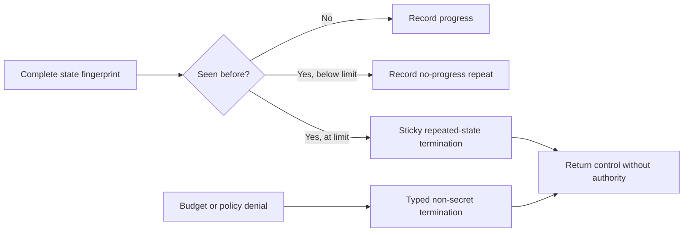

# Story 5.2 Policy and Supervision Evidence

This record consolidates the deterministic local evidence for effect classification, retry and
repair admission, independently accounted parser and model repair, workflow budgets,
repeated-state termination, mutation denial, and execution races. It uses synthetic data and makes
no native-platform, provider, release, or external-effect claim.

## Effect and retry decision table

| Effect class | Permitted retry policy | Required condition | Automatic effect admission |
|---|---|---|---|
| Read only | Never or recoverable read | Current preflight and remaining attempt budget | Only through a fresh admitted attempt |
| Idempotent write | Never or conditional after reconciliation | Safe current reconciliation and fresh idempotency evidence | Only through a fresh admitted attempt |
| Conditional | Never or conditional after reconciliation | Safe current reconciliation | Only through a fresh admitted attempt |
| Non-idempotent | Never | None | Denied |
| Destructive | Never | None | Denied |
| External | Never | None | Denied |
| Unknown | Never | None | Denied |

All policy, decision, admission, preflight, approval, reconciliation, identity, and budget checks
precede the execution gate. A model response is descriptive input and cannot alter this table.

## Registered-operation coverage

The retained effect-taxonomy report maps all 22 `GrantOperation` variants exactly once. Read-only
coverage includes workspace/database reads, credential brokerage, model inference, and draft
creation. Conditional coverage includes workspace writes and bounded Git state transitions.
Destructive coverage includes delete, worktree removal, and administration. External coverage
includes network, push, publish, send, upload, and deploy. Command execution and database writes
remain unknown and therefore cannot be retried automatically.

## Admission and termination state

```mermaid
stateDiagram-v2
    [*] --> Proposed
    Proposed --> Denied: malformed, stale, mismatched, replayed, or over budget
    Proposed --> Admitted: every current prerequisite passes
    Admitted --> Executing: atomic predecessor claim succeeds
    Admitted --> Denied: predecessor already claimed
    Executing --> Succeeded
    Executing --> Failed
    Executing --> Uncertain
    Uncertain --> [*]: reconciliation required; no automatic retry
    Denied --> [*]: inert safe next action
```

## Mutation and race results

The retry corpus retains 79 field-level mutations with zero dispatches: nine effect/retry, 14
failure/uncertainty, nine budget, 21 approval, five preflight, six reconciliation, and 15 attempt
identity mutations. The race trace starts 16 independently eligible contenders at one barrier.
Exactly one predecessor claim enters the callback, the effect probe reaches one, and all other
contenders are denied. The winner returns uncertainty; a later success-returning replay cannot run
or replace that state.

## Reviewer-protocol mapping

| Protocol | Story 5.2 status | Retained evidence | Remaining owner or rerun |
|---|---|---|---|
| `RV-12` | Demonstrated for Story 5.2 local scope | 79 field mutations, complete prior-use ledger, 16-way race, zero duplicate callbacks | Every authority-bearing capability and Sprint 25 |
| `RV-17` | Partial contribution | Sticky repeated-state and uncertain execution state in one runtime process | Durable crash/reopen campaigns in Sprints 12 and 22, then Sprint 25 |
| `RV-25` | Partial prerequisite only | Closed effect table, idempotency/reconciliation denial, uncertain-effect no-retry | External provider execution and reconciliation in Sprint 105, then Sprint 126 |

The reports under `artifacts/sprints/sprint-5/story-5.2/` are authoritative for exact commands,
hashes, counts, and product-truth limitations. This document does not promote a story, sprint, or
release gate beyond those machine records.
