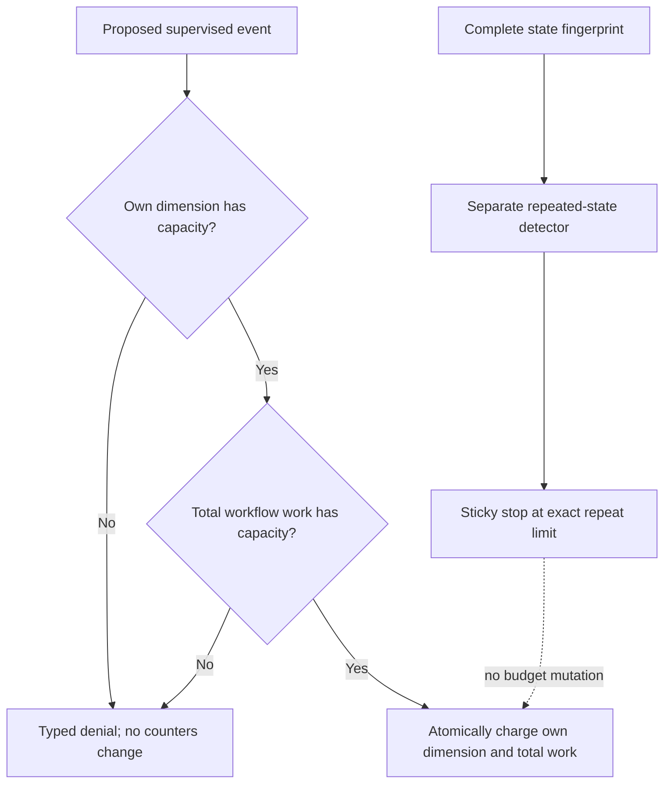

# Story 5.3 Workflow Budget Independence Evidence

This record covers the repository-controlled implementation evidence for Sub-task 5.3.1.3. It
uses synthetic input and performs neither model inference nor a runtime effect. Story, sprint,
native-platform, and release completion remain unclaimed.

## Independent limits

The immutable workflow budget policy now binds parser repair, targeted model repair, step attempts,
per-error-class failures, replanning, and total workflow work to distinct counters. The repeated
state limit remains in a separate content-bound policy and detector because it measures complete
state recurrence rather than resource consumption.

## Repair composition

The deterministic parser-repair wrapper first validates and normalizes input without effects, then
returns it only after the parser-repair and total-work charge commits. The targeted model-repair
wrapper first applies the existing profile, schema, one-repair, and zero-effect-attempt rules, then
returns an admission only after the model-repair and total-work charge commits. Invalid repairs
consume no budget, while a rejected charge mutates no counter.

## Verification scope

Three integration tests jointly exercise all six named limits, independent parser/model exhaustion,
atomic total-work exhaustion, invalid repair rejection, and repeated-state stopping without ledger
mutation. The existing four budget unit tests, four termination unit tests, and repeated-state unit
tests remain enrolled through the full product gate. Strict Clippy and three evidence integrity
tests pass.
