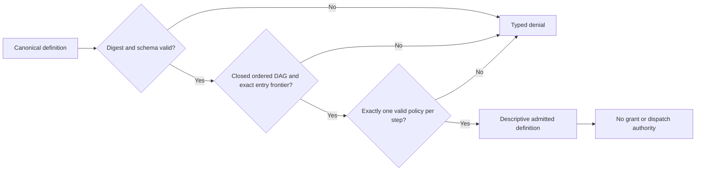

# Story 5.3 Workflow Definition Evidence

This record covers the repository-controlled implementation evidence for Sub-task 5.3.1.1. It
uses synthetic identifiers and executes no workflow effect. It does not claim completion of Story
5.3, Sprint 5, a native-platform gate, or a release.

## Closed graph admission

The kernel admits a workflow only after verifying the canonical definition digest, existing
schema and semantic validation, an acyclic dependency graph, dependency-safe definition order,
and an entry list equal to the complete dependency-free frontier. Every step must name a model or
tool execution surface. Every step must have exactly one immutable policy binding, while unknown,
missing, duplicate, and reused bindings fail closed.

## Exact step-policy binding

Admission binds each step's effect class, retry class, postcondition verifier identities, and all
nine execution budgets to an integrity-verified policy. Preflight and postcondition lists must be
non-empty, bounded, unique, and syntactically valid. High-effect operations require fresh
per-attempt approval policy. Writes require an idempotency key or verified desired-state policy;
read-only work rejects a false idempotency claim.

## Terminal-state closure

The exhaustive lifecycle classifier recognizes ten nonterminal states and eight absorbing
terminal states: succeeded, no-op, blocked, failed, cancelled, timed out, resource exhausted, and
uncertain. The existing closed transition-table validator remains the authority for legal state
changes; the new admission object cannot transition state or execute work.

## Verification scope

The retained report runs eight focused Rust tests plus strict Clippy. Mutations cover definition
and policy digests, entry frontier, dependency order, missing execution surfaces, policy-set
closure, policy identity reuse, all step-bound policy fields, absent preflights, invalid deferred
verification, conservative approval, and idempotency policy. The evidence establishes a local
contract contribution to `AM-WKF-001`, `AM-VER-001`, `AT-WKF-001`, and `AT-VER-001`; later Story
5.3 tasks still own attempt identities, verifier-only completion, adversarial execution, and
`RV-52`.
