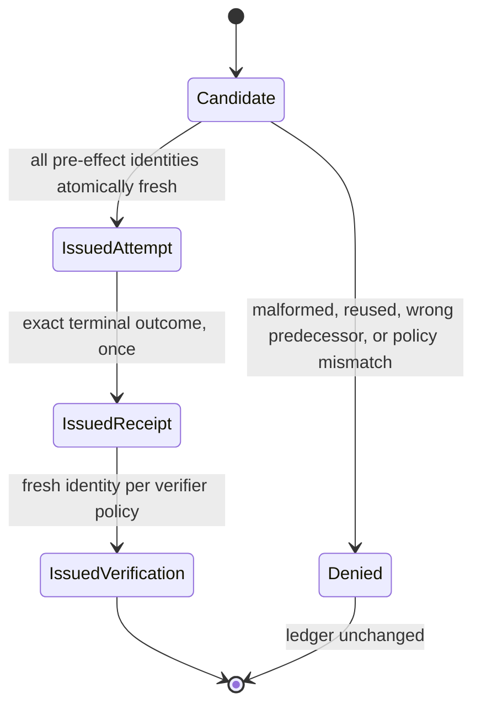

# Story 5.3 Workflow Identity Evidence

This record covers the repository-controlled implementation evidence for Sub-task 5.3.1.2. All
identities are synthetic. The issuer reserves identifiers only: it cannot issue capability
authority, dispatch an operation, manufacture an outcome, or establish completion.

## Atomic identity chain

One workflow-scoped synchronized ledger reserves call, tool-call, attempt, grant, and required
approval identities together. Receipt identities become available only once for the exact issued
attempt after a terminal effect classification. Verification identities then bind the exact
attempt, receipt, and verifier policy. Raw identities are disjoint across all seven roles, so
changing the apparent record type cannot make a used identifier fresh.

## Retry and replay policy

Initial attempts have ordinal one and no predecessor. A successor requires the exact terminal
predecessor and next ordinal. Automatic retry is unavailable for non-idempotent, destructive,
external, and unknown effects. It is also unavailable after an uncertain effect even if later
reconciliation becomes safe; that path requires a separately approved retry. Conditional retries
require current safe reconciliation. High-effect and per-attempt policies require a fresh approval
identity, while `required_once` requires one fresh identity on the initial attempt only.

## Verification scope

Nine focused Rust tests exercise the complete identity chain, atomic rejection, exact attempt
ordering, all four high or unknown effect classes, uncertainty, approval/receipt/verification
single issuance, policy digest tampering, required-once semantics, and a 16-way concurrent race.
The race admits exactly one reservation. Strict Clippy and three evidence integrity tests also
pass. No operation grant contents or effect callback is present, and no Story 5.3, Sprint 5,
native-platform, or release completion is claimed.
