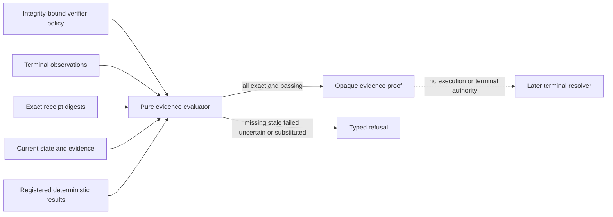

# Story 5.3 Deterministic Workflow Verifier Evidence

This record covers repository-controlled implementation evidence for Sub-task 5.3.2.1. It uses
synthetic records and performs no model inference, tool effect, or network access. It creates no
terminal result and makes no story, sprint, native-platform, or release completion claim.

## Verification boundary

The pure workflow evaluator binds one integrity-protected policy to the exact workflow, task, step,
expected output digest, current-state digest, required deterministic postcondition verifiers,
preserved invariants, prohibited effects, terminal observations, receipt digests, and complete
current evidence set. Every observation and verification result must independently pass canonical
record validation and an exact digest recomputation.

## Fail-closed behavior

The observation and result collections are closed, ordered, unique, and exact. Missing or stale
evidence, a substituted state/output/attempt/receipt, a non-successful or uncertain observation, a
failed or stale verifier result, a missing invariant, or an observed prohibited effect yields a
typed refusal. Exit code zero and persuasive stdout are deliberately ignored and cannot replace a
required deterministic result.

## Verification scope

Four focused integration tests cover the exact passing path, independent state/output/observation/
receipt/evidence bindings, complete postcondition and safety checks, record tampering, and denial of
exit-status or prose-based completion. Strict Clippy and three evidence-integrity and overclaim
tests are retained with the report and raw test log.
